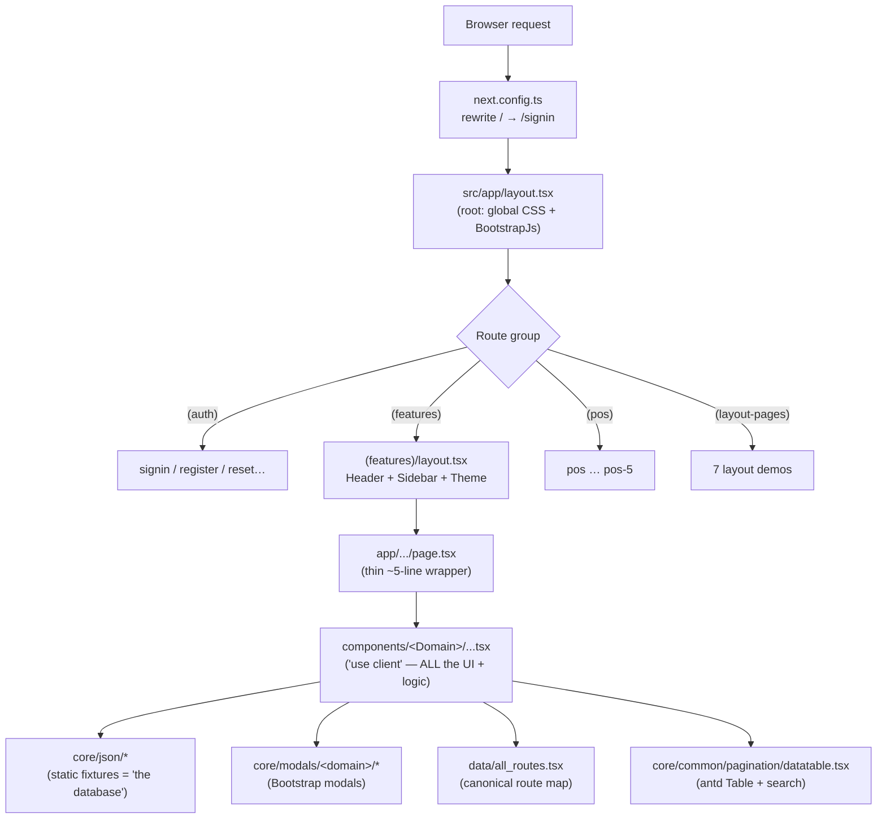
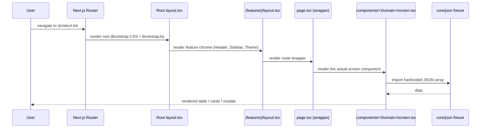
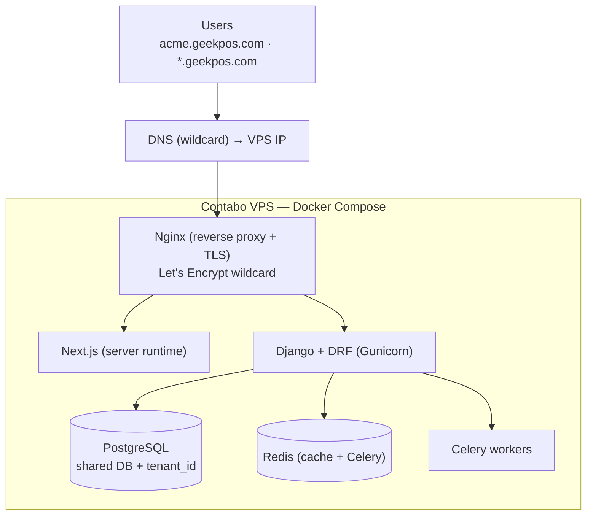

# GeekPOS — Frontend

A commercial **Admin / Point-of-Sale (POS) dashboard UI** built on **Next.js 15 (App Router) + React 19**, based on the *DreamsPOS* template (Dreams Technologies).

> ⚠️ **Read this first.** Today this repo is a **front-end-only UI template** — no backend, API, database, auth, or persisted state. Every screen renders from **hardcoded JSON fixtures**. Think *"UI kit"*, not *"running app"*. It is being adopted as the front-end for a **multi-tenant SaaS product** (Django/DRF backend, subdomain-per-tenant). See [`SAAS_PLAN.md`](SAAS_PLAN.md) for the migration plan — **plan only, no migration code yet.**

---

## 📑 Table of Contents

1. [Quick Start](#-quick-start)
2. [What This Project Is (and Isn't)](#-what-this-project-is-and-isnt)
3. [Tech Stack](#-tech-stack)
4. [Architecture at a Glance](#-architecture-at-a-glance)
5. [The One Pattern That Repeats Everywhere](#-the-one-pattern-that-repeats-everywhere)
6. [Request / Render Flow](#-request--render-flow)
7. [Directory Map](#-directory-map)
8. [Canonical Paths Cheat-Sheet](#-canonical-paths-cheat-sheet)
9. [Component Domains](#-component-domains)
10. [How The Moving Parts Work](#-how-the-moving-parts-work)
11. [Conventions & Gotchas](#-conventions--gotchas)
12. [Scripts](#-scripts)
13. [Project Health & Roadmap](#-project-health--roadmap)
14. [Contributing Workflow](#-contributing-workflow)

---

## 🚀 Quick Start

```bash
# 1. Install dependencies (Node 18+ recommended)
npm install

# 2. Start the dev server
npm run dev            # → http://localhost:3000  (redirects / → /signin)

# 3. Production build (static export → /out)
npm run build
```

| Command | What it does |
|---|---|
| `npm run dev` | Next.js dev server (hot reload) |
| `npm run build` | `next build` → **static export** to `/out` (eslint + type errors ignored) |
| `npm run start` | Serve a production build |
| `npm run lint` | `next lint` |

> There is **no test runner, no CI, and no `.env`** file. Path alias: `@/*` → `./src/*`.

---

## 🧭 What This Project Is (and Isn't)

| ✅ It IS | ❌ It is NOT (yet) |
|---|---|
| A polished admin + POS **UI template** | A working application |
| ~258 routes, ~323 components, fully styled | Connected to any backend / API |
| Driven by static JSON fixtures | Backed by a database |
| Static-export capable (`output: "export"`) | Authenticated / state-managed |
| The future front-end of a SaaS product | Multi-tenant *yet* (see SAAS_PLAN.md) |

**Things that are installed but NOT wired** (don't assume they work):

- **Redux** (`@reduxjs/toolkit`, `react-redux`, `redux-persist`) — no store, no `<Provider>`. App is effectively **stateless** (local `useState` + prop drilling).
- **i18n** (`react-i18next`) — never initialized. Translation files are dead assets.
- **`href="#"` everywhere** (4500+) — placeholder links/buttons that do nothing.
- **No Context, no custom hooks, no fetch/API layer, no tests.**

---

## 🛠 Tech Stack

| Concern | Choice |
|---|---|
| **Framework** | Next.js `^15.5.2` (App Router) |
| **UI Library** | React `^19.2.1` |
| **Language** | TypeScript `strict: true` (but `no-explicit-any` **off** → 400+ `: any`; `.tsx/.jsx/.js` mixed) |
| **Styling** | Bootstrap 5 + SCSS (`src/style/scss`) + react-bootstrap + antd theming |
| **Icons** | Tabler (`ti ti-*`, primary), Feather, FontAwesome, Line Awesome |
| **Tables** | Ant Design `Table`, wrapped in `core/common/pagination/datatable.tsx` |
| **Charts** | ApexCharts **and** Chart.js (both present) |
| **Forms / UI** | react-select, antd, primereact, daterangepicker, sweetalert2, FullCalendar, Swiper, slick |
| **State** | Redux installed but **unwired** → stateless |
| **Build** | Static export → `/out`. `eslint.ignoreDuringBuilds: true`. Rewrites `/` → `/signin` |

---

## 🏗 Architecture at a Glance



**Key idea:** routes are *thin*, components are *fat*. The `app/.../page.tsx` file is a 5-line wrapper that just renders a component. **All UI and logic live in `src/components/<Domain>/`.**

---

## 🔁 The One Pattern That Repeats Everywhere

To change a screen, edit its component under `src/components/<Domain>/` — **NOT** `src/app/`.

```
src/app/(features)/(Inventory)/product-list/page.tsx   ← thin route wrapper (imports the component)
  └─ src/components/Inventory/productList/productlist.tsx   ← "use client", ALL the UI + logic + columns
       ├─ data:   src/core/json/productlistdata.tsx          ← static array (the "database")
       ├─ table:  @/core/common/pagination/datatable          ← antd Table wrapper w/ built-in search
       ├─ modals: src/core/modals/inventory/...               ← Bootstrap modals imported into the component
       └─ links:  all_routes from @/data/all_routes           ← never hardcode paths
```

---

## 🔄 Request / Render Flow



---

## 🗂 Directory Map

```
src/
├── app/                      # App Router. 258 page.tsx — THIN wrappers (~5 lines).
│   ├── (auth)/               #   signin/-2/-3, register, forgot/reset-password, verification, lock, 404/500
│   ├── (features)/           #   THE BULK. layout.tsx adds Header+Sidebar+Theme. Nested groups:
│   │                         #     (dashboard)(Inventory)(stock)(sales)(purchases)(finance & accounts)
│   │                         #     (hrm)(reports)(promo)(people)(settings)(user-management)
│   │                         #     (application)(uiinterface)(pages)(cms)(superadmin)
│   ├── (layout-pages)/       #   7 layout-variant demos (rtl, dark, horizontal, two-column, detached…)
│   ├── (pos)/                #   pos, pos-2 … pos-5 (5 POS screen variants)
│   ├── layout.tsx            #   root layout (global CSS + Bootstrap JS, NO providers)
│   └── global.scss
├── components/               # 323 .tsx — the ACTUAL UI. One folder per domain.
├── core/
│   ├── common/               # shared widgets: header, sidebar, footer, datatable, pagination,
│   │                         #   selectOption, datepickers, texteditor, modal/commonDeleteModal …
│   ├── json/                 # 92 fixture files (the "database") + siderbar_data.tsx (nav menu)
│   └── modals/               # 85 Bootstrap modals grouped by domain
├── data/
│   └── all_routes.tsx        # central route-name → path map (~299 entries). Import `all_routes`.
├── environment.tsx           # exports image_path ('/') used by image-with-base-path
└── style/                    # css, scss (layout/theme), fonts, icons, i18n (unwired)
public/                       # assets/, favicon, manifest, prebuilt index.html
```

### Project Stats

| Metric | Count |
|---|---|
| Route pages (`page.tsx`) | **258** |
| Component files (`.tsx`) | **323** |
| JSON fixtures (`core/json`) | **92** |
| Bootstrap modals (`core/modals`) | **85** |
| Avg components per page | ~3.5 |
| `all_routes` entries | ~299 |

---

## 📍 Canonical Paths Cheat-Sheet

| Need | Path |
|---|---|
| Route → path map (canonical) | `src/data/all_routes.tsx` |
| Sidebar menu data | `src/core/json/siderbar_data.tsx` *(note misspelling "**sider**bar")* |
| Sidebar / Header / Footer | `src/core/common/sidebar/sidebar.tsx`, `…/header/header.tsx`, `…/footer/commonFooter.tsx` |
| DataTable (antd + search) | `src/core/common/pagination/datatable.tsx` — props: `columns`, `dataSource`, `props` |
| react-select option lists | `src/core/common/selectOption/selectOption.tsx` (30+ `{label,value}` arrays) |
| Theme / layout switcher | `src/core/common/sidebar/themeSettings.tsx` |
| Asset base-path `` | `src/core/common/image-with-base-path/index.tsx` |
| Fixture data | `src/core/json/` (92 files; `.tsx/.jsx/.js` mixed) |
| Modals | `src/core/modals/<domain>/` (85 files; Bootstrap `data-bs-toggle`) |
| Feature chrome (Header+Sidebar+Theme) | `src/app/(features)/layout.tsx` |
| Root layout (global CSS + Bootstrap JS) | `src/app/layout.tsx` |

---

## 🧩 Component Domains

### Real business screens (these are what the future Django API will wire up)

| Domain | Covers | Key screens |
|---|---|---|
| `pos-module/pos` | Point-of-sale checkout (5 variants) | `pos.tsx` (1798 LOC) + `pos2..pos5`, `posHeader.tsx` |
| `Inventory` | Products & master data | productList *(canonical)*, add/edit-product, product-details, category, sub-categories, brand, units, variant-attributes, warranty, barcode, qrcode, low-stocks, expired-products |
| `stock` | Inventory movement | manage-stock, stock-adjustment, stock-transfer |
| `sales` | Sales & orders | invoice (list + details), quotation, online-orders, pos-orders, sale-return |
| `purchase` | Procurement | purchase-list, purchase-returns, purchase-order-report |
| `FinanceAccounts` | Accounting | account-list, account-statement, balance-sheet, cash-flow, income, trial-balance, money-transfer, expenses |
| `hrm` | HR & payroll | employees, departments, designation, shifts, attendance, leaves, leave-types, holidays, payroll, payslip |
| `Reports` | Analytics | sales/purchase/inventory/supplier/customer/expense/income/tax/profit-loss/annual + due/expiry |
| `people` | Master data | suppliers, billers, warehouses, store-list |
| `promo` | Promotions | discount, discount-plan, coupons, gift-card |
| `dashboards` | KPI boards | `newdashboard.tsx` (admin), `dashboard.tsx`, `saledashboard.tsx` |
| `settings` | Config | 31 form screens: general/financial/system/website/app/other + settingssidebar |
| `usermanagement` | Users / roles | users, roles-permissions, permissions, delete-account |
| `superadmin` | SaaS tenant admin | companies, domain, package, subscription, purchase-transaction, dashboard |
| `pages` | Auth / generic page bodies | login, register, forgot/reset, verification, error pages |

### Template filler / UI-kit demos (likely NOT wired to the API — don't over-invest)

`uiinterface` (~64 UI-kit demos incl. 3.6k-line navtabs & 3.1k dropdowns) · `charts` (~48 chart demos) · `application` (chat, email, notes, todo, file-manager, calendar, calls — all mock) · `cms` (blog/pages/faq/testimonials) · `layout-pages` (7 layout demos) · `bootstrap-js`.

---

## ⚙️ How The Moving Parts Work

**Root layout** (`src/app/layout.tsx`) — bare server component. Imports Bootstrap CSS + `global.scss` + icon CSS, renders `{children}` and `<BootstrapJs/>`. **No providers.**

**`BootstrapJs`** (`src/components/bootstrap-js/bootstrapjs.tsx`) — client component that `require('bootstrap/dist/js/bootstrap.bundle.min.js')` in a `useEffect`. This is what makes `data-bs-toggle` modals/dropdowns/tooltips work under static export.

**Feature chrome** (`src/app/(features)/layout.tsx`) — wraps feature pages with `<Header/>`, `<Sidebar/>`, `<HorizontalSidebar/>`, `<TwoColumnSidebar/>`, `<ThemeSettings/>`. Still no providers/Redux.

**Navigation** — menu is data-driven from `src/core/json/siderbar_data.tsx` (nested sections → submenus → leaves), each `link:` pulled from `all_routes`. `sidebar.tsx` uses `usePathname()` for active state.

**Theme / layout variants** (dark, RTL, mini, horizontal, detached, box, color accents) — managed **locally** in `themeSettings.tsx` via `useState`, **persisted to cookies** (`js-cookie`), and applied by setting `data-layout` / `data-theme` / `data-width` / `data-color` attributes on `<html>`/`<body>`. SCSS in `src/style/scss/layout/` keys off those attributes. **No global theme state** — components read `document.documentElement` attributes / cookies.

**DataTable** (`datatable.tsx`) — wraps antd `Table`. Props `{ columns, dataSource, props }`. Built-in case-insensitive search across all fields, antd `rowSelection`, custom pagination (10/20/30). Columns are defined **inline** in each screen.

**Modals are Bootstrap, not antd:**

```tsx
// Trigger (in a button / table action cell):
<Link href="#" data-bs-toggle="modal" data-bs-target="#add-brand">Add Brand</Link>

// Modal body (component in src/core/modals/<domain>/…, imported into the screen):
<div className="modal fade" id="add-brand"> … <button data-bs-dismiss="modal">Cancel</button> … </div>
```

Forms inside modals are non-functional (submit is usually an `href="#"` link). Shared delete confirm: `src/core/common/modal/commonDeleteModal.tsx`.

**Fixture data** (`src/core/json/`) — `export const <name> = [ { id, …display fields… }, … ]`, all `any`-typed. Import by name: `import { productlistdata } from "@/core/json/productlistdata"`. Each fixture maps 1:1 to a future Django endpoint (keep field names stable to minimize column edits).

---

## ⚠️ Conventions & Gotchas

- Almost every component starts with `"use client"` (298/323) — client-rendered, SPA-style.
- **Edit features in `src/components/<Domain>/…`**, not `src/app/.../page.tsx` (just a wrapper).
- **Add links via `all_routes`** (`src/data/all_routes.tsx`) — don't hardcode paths.
- Reuse `datatable.tsx` for tables. Sorters that compare `.length` are a template quirk — **don't copy that** as "correct sorting".
- `href="#"` (4500+) = non-functional placeholder. Don't assume links/actions do anything.
- Use `<ImageWithBasePath src="assets/img/…" />` for assets — matters for sub-path / static-export hosting.
- File extensions are inconsistent even within `core/json` — **match the neighbor file** when adding.
- Don't expect a backend, auth, persisted state, working i18n, or a Redux store.

---

## 📜 Scripts

```bash
npm run dev      # next dev (http://localhost:3000)
npm run build    # next build → static export to /out (eslint + type errors ignored)
npm run start    # next start
npm run lint     # next lint
```

No test runner (0 tests). No CI. No `.env*`.

---

## 🩺 Project Health & Roadmap

**Maintainable as a template: partially. Scalable to a real product: not as-is.**

**Strengths:** clear per-domain taxonomy · thin pages + fat components · modern stack · central route map.

**Risks to address before building a product on top:**

| Risk | Detail |
|---|---|
| No data/state/API layer | Hardcoded JSON; Redux unused; wiring a backend touches ~all 323 components |
| Type safety nominal | `strict:true` but `no-explicit-any` off, 400+ `any`, `ignoreDuringBuilds:true` → build catches nothing |
| Giant components | `uiinterface/navtabs.tsx` 3605 LOC, `dropdowns.tsx` 3108, `application/filemanager.tsx` 2637, `pos.tsx` 1798 |
| Dead / placeholder UI | 4500+ `href="#"`, length-based sorters, duplicate variants (pos..pos-5, signin/-2/-3) |
| Dependency bloat | `package.json` lists `npm`, `i`, and overlapping libs (chart.js *and* apexcharts; react-dnd *and* @hello-pangea/dnd *and* dragula) |
| No tests, CI, or env config | — |

**First steps toward a product** (mirrors [`SAAS_PLAN.md`](SAAS_PLAN.md)):

1. Introduce an API client + **TanStack Query**, and actually configure **Redux** + `<Provider>`.
2. Re-enable `no-explicit-any` / `ignoreDuringBuilds:false` incrementally.
3. Decompose 2k+ LOC components.
4. Prune duplicate variants & unused deps.
5. Replace `href="#"` with real `all_routes` links + mutations.
6. Drop the static export (`output:"export"`) — a server runtime is needed for auth/middleware/subdomain-per-tenant.

> Per-page component breakdown lives in **`page-component-count.csv`** (project root): columns `route, mainLOC, components`.

### Planned SaaS direction (locked decisions)



- **Backend:** Django (DRF) + SimpleJWT, separate service. REST, one ViewSet per resource.
- **Tenancy:** subdomain-per-tenant, shared DB with `tenant_id`; resolved via `X-Tenant` header.
- **Connection:** `src/lib/api/client.ts` (JWT + `X-Tenant`) → TanStack Query hooks replace JSON fixtures.
- **Hosting:** **self-hosted on Contabo VPS** with Docker Compose + Nginx + Postgres + Redis + Celery.
- **Keep almost all modules.** Drop the static export (needs a server runtime).
- **Full plan** — now includes a connection/request sequence diagram, hosting & infrastructure section, and a
  complete backend data model (Django ER diagram + per-model field table): **[`SAAS_PLAN.md`](SAAS_PLAN.md)**.
  *Status: plan only — no migration code written yet.*

---

## 🤝 Contributing Workflow

1. **Find the screen** → `src/app/(features)/.../page.tsx` tells you which component it renders.
2. **Edit the component** → `src/components/<Domain>/...tsx` (the fat file with all logic).
3. **Need data?** → edit/add a fixture in `src/core/json/` (match the neighbor file's extension).
4. **Need a link?** → use `all_routes` from `src/data/all_routes.tsx`.
5. **Need a modal?** → Bootstrap modal in `src/core/modals/<domain>/`, triggered via `data-bs-toggle`.
6. **Need a table?** → reuse `core/common/pagination/datatable.tsx`.
7. **Run `npm run dev`** and verify in the browser.

> 📖 A deeper, AI-assistant-oriented primer lives in [`CLAUDE.md`](CLAUDE.md) — read it for the full verified context.

---

*Based on the DreamsPOS template by Dreams Technologies. Adapted as the GeekPOS SaaS front-end.*
