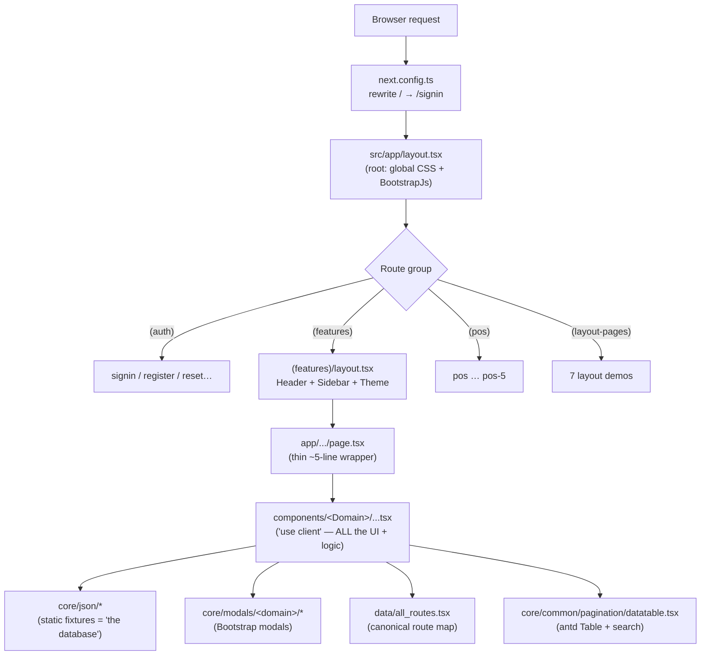
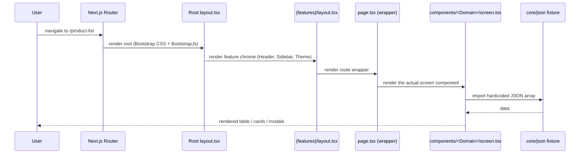
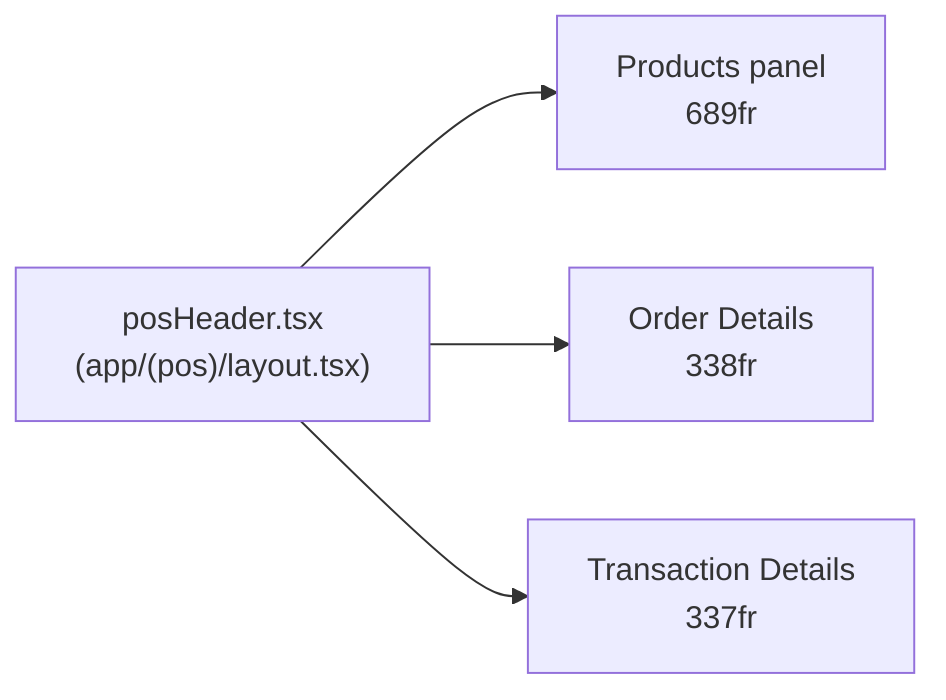
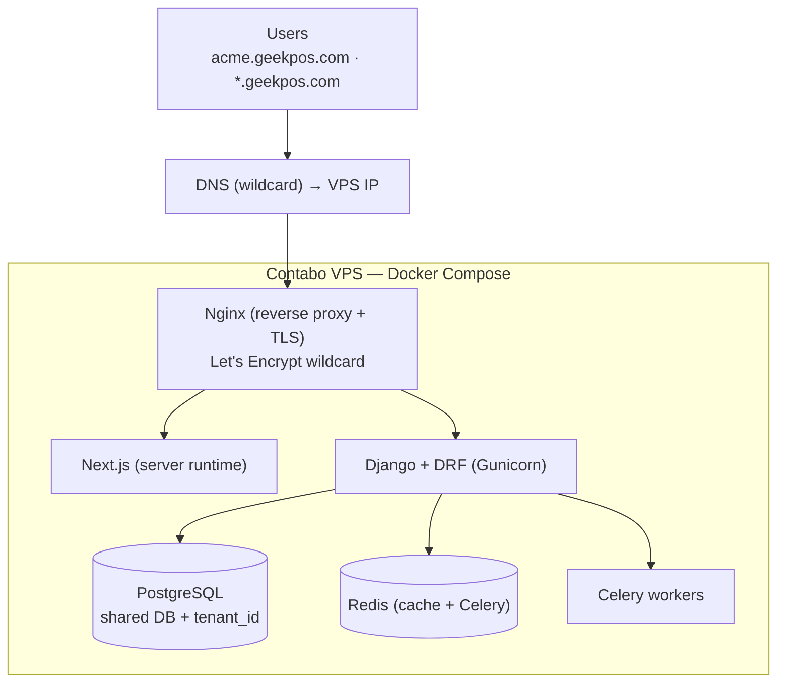

<div align="center">

# 🛒 GeekPOS — Frontend

**Retail POS & admin dashboard front-end for a multi-tenant SaaS product**
Built on **Next.js 15** (App Router) + **React 19**

</div>

> [!WARNING]
> **Read this before you touch anything.** This repo is the **GeekPOS front-end** — no backend, API,
> database, auth, or persisted state yet. Most screens still render from **hardcoded JSON fixtures**;
> a few modules (POS, dashboards, sales/stock/purchase/promo) have active GeekPOS development with
> working front-end logic. SaaS migration plan: [`SAAS_PLAN.md`](SAAS_PLAN.md) — **plan only, no backend code yet.**

---

## 🧭 Reading guide

New here? Jump to what you need:

| I want to… | Go to |
|---|---|
| **Run it locally** | [Quick Start](#-quick-start) |
| **Understand what it is / isn't** | [Project Status](#-project-status) |
| **See the big picture** | [Architecture](#-architecture) · [The Core Pattern](#-the-core-pattern) |
| **Find where a thing lives** | [Directory Map](#-directory-map) · [Canonical Paths](#-canonical-paths) |
| **Change a screen** | [The Core Pattern](#-the-core-pattern) · [Contributing Workflow](#-contributing-workflow) |
| **Write tests** | [Testing](#-testing-required) |
| **Work on the POS screen** | [POS Module (`/pos`)](#-pos-module-pos) |
| **See Figma-aligned dashboards** | [Dashboards](#-dashboards) |
| **Follow the modular screen pattern** | [Modular Screen Pattern](#-modular-screen-pattern) |
| **Know the conventions / gotchas** | [Conventions & Gotchas](#-conventions--gotchas) |
| **See where this is heading** | [Roadmap & SaaS Direction](#-roadmap--saas-direction) |

### 📚 Related docs
| Doc | Purpose |
|---|---|
| [`SAAS_PLAN.md`](SAAS_PLAN.md) | Backend (Django ER model), FE↔BE connection, hosting/infra, phased rollout |
| [`SQA_PLAN.md`](SQA_PLAN.md) | QA standard — test levels, defect lifecycle, module scope, release sign-off |
| [`CLAUDE.md`](CLAUDE.md) | Deep AI-assistant primer (verified against the code) |
| [`page-component-count.csv`](page-component-count.csv) | Per-page LOC + component counts (decomposition targets) |

---

<details>
<summary><b>📑 Full Table of Contents</b></summary>

**Part 1 · Getting Started**
- [Quick Start](#-quick-start)
- [Project Status](#-project-status)
- [Tech Stack](#-tech-stack)

**Part 2 · Understanding the Codebase**
- [Architecture](#-architecture)
- [The Core Pattern](#-the-core-pattern)
- [Request / Render Flow](#-request--render-flow)
- [Directory Map](#-directory-map)
- [Component Domains](#-component-domains)

**Part 3 · Working in the Codebase**
- [Canonical Paths](#-canonical-paths)
- [How the Moving Parts Work](#-how-the-moving-parts-work)
- [POS Module (`/pos`)](#-pos-module-pos)
- [Dashboards](#-dashboards)
- [Modular Screen Pattern](#-modular-screen-pattern)
- [Currency (BDT)](#-currency-bdt)
- [Conventions & Gotchas](#-conventions--gotchas)
- [Testing (required)](#-testing-required)
- [Contributing Workflow](#-contributing-workflow)

**Part 4 · Product Direction**
- [Roadmap & SaaS Direction](#-roadmap--saas-direction)

</details>

---

# Part 1 · Getting Started

## 🚀 Quick Start

```bash
npm install      # 1. install deps (Node 18+ recommended)
npm run dev      # 2. start dev server → http://localhost:3000  (/ redirects to /signin)
npm run build    # 3. production build → static export to /out
```

| Script | What it does |
|---|---|
| `npm run dev` | Next.js dev server (hot reload) |
| `npm run build` | `next build` → **static export** to `/out` (eslint + type errors ignored) |
| `npm run start` | Serve a production build |
| `npm run lint` | `next lint` |
| `npm test` | ⚠️ Not wired yet — see [Testing](#-testing-required) for the required setup |

> Path alias: `@/*` → `./src/*`. No `.env` file, no CI (yet).

---

## 📊 Project Status

### What it IS vs. what it is NOT (yet)

| ✅ It IS | ❌ It is NOT (yet) |
|---|---|
| A polished admin + POS **UI** with active GeekPOS development | Fully connected to a backend / API *(in progress)* |
| ~258 routes, hundreds of components, fully styled | All modules wired to Django |
| **`/pos` — Figma checkout with live cart + loyalty** | Persisted sales data (DB) |
| **Admin & sales dashboards — Figma-aligned, modular** | Real-time analytics from API |
| **Sales, stock, purchase, promo — modular refactor done** | Every screen decomposed yet |
| **Default currency: BDT (৳)** via `src/lib/currency.ts` | Multi-currency backend |
| Driven by static JSON fixtures (most screens) | Backed by a database everywhere |
| Static-export capable (`output: "export"`) | Authenticated / state-managed |
| The front-end of a SaaS product | Multi-tenant *yet* (see SAAS_PLAN.md) |

### GeekPOS work completed (vs. template filler)

| Area | Route(s) | Status |
|---|---|---|
| **POS checkout** | `/pos` | Figma redesign · 34+ components · live cart, loyalty, sessionStorage hold/draft |
| **Admin dashboard** | `/admin-dashboard` | Decomposed into `NewDashboard/` (~40 components) · Figma SCSS |
| **Sales dashboard** | `/sales-dashboard` | Decomposed into `SalesDashboard/` · KPI cards, charts, recent transactions |
| **Sales module** | `/invoice`, `/quotation-list`, … | Folder-per-screen: PageHeader, Filters, Table, columns, hooks |
| **Stock module** | `/manage-stocks`, `/stock-adjustment`, `/stock-transfer` | Same modular pattern |
| **Purchase module** | `/purchase-list`, `/purchase-returns`, … | Same modular pattern |
| **Promo module** | `/coupons`, `/discount`, … | Same modular pattern |
| **App chrome** | Header, sidebar | Header split into subcomponents under `core/common/header/header/` |

Legacy monolith entry points from the refactor live in **`src/old-codes/`** (not used by active routes).

### ⚠️ Installed but NOT wired — don't assume these work
- **Redux** (`@reduxjs/toolkit`, `react-redux`, `redux-persist`) — no store, no `<Provider>`. App is effectively **stateless** (local `useState` + prop drilling).
- **i18n** (`react-i18next`) — never initialized. Translation files are dead assets.
- **`href="#"` everywhere** (4500+) — placeholder links/buttons that do nothing.
- **No** Context, custom hooks, fetch/API layer, or tests.

---

## 🛠 Tech Stack

| Concern | Choice |
|---|---|
| **Framework** | Next.js `^15.5.2` (App Router) |
| **UI Library** | React `^19.2.1` |
| **Language** | TypeScript `strict: true` (but `no-explicit-any` **off** → 400+ `: any`; `.tsx/.jsx/.js` mixed) |
| **Styling** | Bootstrap 5 + SCSS (`src/style/scss`) + react-bootstrap + antd theming |
| **Icons** | Tabler (`ti ti-*`, primary), Feather, FontAwesome, Line Awesome |
| **Tables** | Ant Design `Table`, wrapped in `core/common/pagination/datatable.tsx` |
| **Charts** | ApexCharts **and** Chart.js (both present) |
| **Forms / UI** | react-select, antd, primereact, daterangepicker, sweetalert2, FullCalendar, Swiper, slick |
| **State** | Redux installed but **unwired** → stateless |
| **Build** | Static export → `/out`. `eslint.ignoreDuringBuilds: true`. Rewrites `/` → `/signin` |

---

# Part 2 · Understanding the Codebase

## 🏗 Architecture

> **One idea to remember:** routes are *thin*, components are *fat*. A `page.tsx` is a ~5-line wrapper that
> just renders a component. **All UI and logic live in `src/components/<Domain>/`.**



---

## 🔁 The Core Pattern

To change a screen, edit its component under `src/components/<Domain>/` — **NOT** `src/app/`.

**Classic (single-file) screens** still use one fat component + inline columns:

```
src/app/(features)/(Inventory)/product-list/page.tsx   ← thin route wrapper
  └─ src/components/Inventory/productList/productlist.tsx   ← "use client", UI + logic + columns
       ├─ data:   src/core/json/productlistdata.tsx
       ├─ table:  @/core/common/pagination/datatable
       ├─ modals: src/core/modals/inventory/...
       └─ links:  all_routes from @/data/all_routes
```

**Refactored screens** (sales, stock, purchase, promo, dashboards, POS) use a **folder-per-route** layout — see [Modular Screen Pattern](#-modular-screen-pattern).

---

## 🔄 Request / Render Flow



---

## 🗂 Directory Map

```
src/
├── app/                      # App Router. 258 page.tsx — THIN wrappers (~5 lines).
│   ├── (auth)/               #   signin/-2/-3, register, forgot/reset-password, verification, lock, 404/500
│   ├── (features)/           #   THE BULK. layout.tsx adds Header+Sidebar+Theme. Nested groups:
│   │                         #     (dashboard)(Inventory)(stock)(sales)(purchases)(finance & accounts)
│   │                         #     (hrm)(reports)(promo)(people)(settings)(user-management)
│   │                         #     (application)(uiinterface)(pages)(cms)(superadmin)
│   ├── (layout-pages)/       #   7 layout-variant demos (rtl, dark, horizontal, two-column, detached…)
│   ├── (pos)/                #   pos, pos-2 … pos-5 (5 POS screen variants)
│   ├── layout.tsx            #   root layout (global CSS + Bootstrap JS, NO providers)
│   └── global.scss
├── components/               # The ACTUAL UI. One folder per domain.
│   ├── NewDashboard/       #   Admin dashboard (Figma-aligned, modular)
│   ├── SalesDashboard/     #   Sales dashboard (Figma-aligned, modular)
│   ├── pos-module/pos/     #   Canonical POS (`index.tsx` + ~34 child components)
│   ├── sales/              #   Modular: invoice/, quotation/, online-orders/, …
│   ├── stock/              #   Modular: managestock/, stock-adjustment/, stock-transfer/
│   ├── purchase/           #   Modular: purchase-list/, purchase-returns/, …
│   └── promo/              #   Modular: coupons/, discount/, discount-plan/, gift-cards/
├── lib/
│   └── currency.ts         # BDT formatting — formatCurrency(), parseCurrency()
├── old-codes/              # Archived legacy monoliths (not used by routes)
├── core/
│   ├── common/               # shared widgets: header, sidebar, footer, datatable, pagination,
│   │                         #   selectOption, datepickers, texteditor, modal/commonDeleteModal …
│   ├── json/                 # 92 fixture files (the "database") + siderbar_data.tsx (nav menu)
│   └── modals/               # 85 Bootstrap modals grouped by domain
├── data/
│   └── all_routes.tsx        # central route-name → path map (~299 entries). Import `all_routes`.
├── environment.tsx           # image_path + re-exports currency helpers
└── style/                    # css, scss (layout/theme), fonts, icons, i18n (unwired)
public/                       # assets/, favicon, manifest, prebuilt index.html
```

**Project stats:** 258 route pages · 323 components · 92 JSON fixtures · 85 modals · ~299 routes · ~3.5 components/page

---

## 🧩 Component Domains

### Real business screens — what the future Django API will wire up

| Domain | Covers | Key screens |
|---|---|---|
| `pos-module/pos` | POS checkout | **`index.tsx`** (canonical `/pos` — Figma redesign, live cart) · legacy `pos.tsx` + `pos2..pos5` at `/pos-2` … `/pos-5` |
| `NewDashboard` | Admin KPI board | `/admin-dashboard` — modular Figma redesign (replaces legacy `newdashboard.tsx` in `old-codes/`) |
| `SalesDashboard` | Sales analytics | `/sales-dashboard` — KPI cards, best sellers, charts, recent transactions |
| `Inventory` | Products & master data | productList *(canonical)*, add/edit-product, product-details, category, sub-categories, brand, units, variant-attributes, warranty, barcode, qrcode, low-stocks, expired-products |
| `sales` | Sales & orders | **Modular:** `invoice/`, `invoice-details/`, `quotation/`, `online-orders/`, `pos-orders/`, `sale-return/` |
| `stock` | Inventory movement | **Modular:** `managestock/`, `stock-adjustment/`, `stock-transfer/` |
| `purchase` | Procurement | **Modular:** `purchase-list/`, `purchase-returns/`, `purchase-order-report/` |
| `promo` | Promotions | **Modular:** `coupons/`, `discount/`, `discount-plan/`, `gift-cards/` |
| `FinanceAccounts` | Accounting | account-list, account-statement, balance-sheet, cash-flow, income, trial-balance, money-transfer, expenses |
| `hrm` | HR & payroll | employees, departments, designation, shifts, attendance, leaves, leave-types, holidays, payroll, payslip |
| `Reports` | Analytics | sales/purchase/inventory/supplier/customer/expense/income/tax/profit-loss/annual + due/expiry |
| `people` | Master data | suppliers, billers, warehouses, store-list |
| `dashboards` | Legacy KPI boards | `dashboard.tsx`, `saledashboard.tsx` — superseded by `NewDashboard/` and `SalesDashboard/` for main routes |
| `settings` | Config | 31 form screens: general/financial/system/website/app/other + settingssidebar |
| `usermanagement` | Users / roles | users, roles-permissions, permissions, delete-account |
| `superadmin` | SaaS tenant admin | companies, domain, package, subscription, purchase-transaction, dashboard |
| `pages` | Auth / generic page bodies | login, register, forgot/reset, verification, error pages |

### Template filler — likely NOT wired to the API (don't over-invest)
`uiinterface` (~64 UI-kit demos incl. 3.6k-line navtabs & 3.1k dropdowns) · `charts` (~48 chart demos) ·
`application` (chat, email, notes, todo, file-manager, calendar, calls — all mock) · `cms` (blog/pages/faq/testimonials) ·
`layout-pages` (7 layout demos) · `bootstrap-js`.

---

# Part 3 · Working in the Codebase

## 📍 Canonical Paths

| Need | Path |
|---|---|
| Route → path map (canonical) | `src/data/all_routes.tsx` |
| Sidebar menu data | `src/core/json/siderbar_data.tsx` *(note misspelling "**sider**bar")* |
| Sidebar / Header / Footer | `src/core/common/sidebar/sidebar.tsx`, `…/header/header.tsx` (+ subcomponents in `header/header/`), `…/footer/commonFooter.tsx` |
| Currency (BDT) | `src/lib/currency.ts` — `formatCurrency()`, `parseCurrency()`; also re-exported from `environment.tsx` |
| Archived legacy monoliths | `src/old-codes/` — not imported by active routes |
| DataTable (antd + search) | `src/core/common/pagination/datatable.tsx` — props: `columns`, `dataSource`, `props` |
| react-select option lists | `src/core/common/selectOption/selectOption.tsx` (30+ `{label,value}` arrays) |
| Theme / layout switcher | `src/core/common/sidebar/themeSettings.tsx` |
| Asset base-path `` | `src/core/common/image-with-base-path/index.tsx` |
| Fixture data | `src/core/json/` (92 files; `.tsx/.jsx/.js` mixed) |
| Modals | `src/core/modals/<domain>/` (85 files; Bootstrap `data-bs-toggle`) |
| Feature chrome (Header+Sidebar+Theme) | `src/app/(features)/layout.tsx` |
| Root layout (global CSS + Bootstrap JS) | `src/app/layout.tsx` |
| **POS screen (canonical)** | `src/components/pos-module/pos/index.tsx` |
| POS cart & loyalty logic | `usePosCart.ts`, `posLoyaltyConfig.ts` |
| POS route + chrome | `src/app/(pos)/pos/page.tsx`, `src/app/(pos)/layout.tsx` |
| Admin dashboard | `src/components/NewDashboard/` · route: `src/app/(features)/(dashboard)/admin-dashboard/page.tsx` |
| Sales dashboard | `src/components/SalesDashboard/` · route: `src/app/(features)/(dashboard)/sales-dashboard/page.tsx` |

---

## ⚙️ How the Moving Parts Work

<details>
<summary><b>Root layout & Bootstrap JS</b></summary>

**Root layout** (`src/app/layout.tsx`) — bare server component. Imports Bootstrap CSS + `global.scss` + icon
CSS, renders `{children}` and `<BootstrapJs/>`. **No providers.**

**`BootstrapJs`** (`src/components/bootstrap-js/bootstrapjs.tsx`) — client component that
`require('bootstrap/dist/js/bootstrap.bundle.min.js')` in a `useEffect`. This is what makes `data-bs-toggle`
modals/dropdowns/tooltips work under static export.

**Feature chrome** (`src/app/(features)/layout.tsx`) — wraps feature pages with `<Header/>`, `<Sidebar/>`,
`<HorizontalSidebar/>`, `<TwoColumnSidebar/>`, `<ThemeSettings/>`. Still no providers/Redux.
</details>

<details>
<summary><b>Navigation & theming</b></summary>

**Navigation** — menu is data-driven from `src/core/json/siderbar_data.tsx` (nested sections → submenus →
leaves), each `link:` pulled from `all_routes`. `sidebar.tsx` uses `usePathname()` for active state.

**Theme / layout variants** (dark, RTL, mini, horizontal, detached, box, color accents) — managed **locally**
in `themeSettings.tsx` via `useState`, **persisted to cookies** (`js-cookie`), and applied by setting
`data-layout` / `data-theme` / `data-width` / `data-color` attributes on `<html>`/`<body>`. SCSS in
`src/style/scss/layout/` keys off those attributes. **No global theme state** — components read
`document.documentElement` attributes / cookies.
</details>

<details>
<summary><b>DataTable, modals & fixtures</b></summary>

**DataTable** (`datatable.tsx`) — wraps antd `Table`. Props `{ columns, dataSource, props }`. Built-in
case-insensitive search across all fields, antd `rowSelection`, custom pagination (10/20/30). Columns are
defined **inline** in each screen.

**Modals are Bootstrap, not antd:**
```tsx
// Trigger (in a button / table action cell):
<Link href="#" data-bs-toggle="modal" data-bs-target="#add-brand">Add Brand</Link>

// Modal body (component in src/core/modals/<domain>/…, imported into the screen):
<div className="modal fade" id="add-brand"> … <button data-bs-dismiss="modal">Cancel</button> … </div>
```
Forms inside modals are non-functional (submit is usually an `href="#"` link). Shared delete confirm:
`src/core/common/modal/commonDeleteModal.tsx`.

**Fixture data** (`src/core/json/`) — `export const <name> = [ { id, …display fields… }, … ]`, all
`any`-typed. Import by name: `import { productlistdata } from "@/core/json/productlistdata"`. Each fixture
maps 1:1 to a future Django endpoint (keep field names stable to minimize column edits).
</details>

---

## ⚠️ Conventions & Gotchas

| ✅ Do | 🚫 Don't |
|---|---|
| Edit features in `src/components/<Domain>/…` | Edit `src/app/.../page.tsx` (it's just a wrapper) |
| Add links via `all_routes` (`src/data/all_routes.tsx`) | Hardcode paths |
| Reuse `datatable.tsx` for tables | Copy its `.length`-based sorters (template quirk, not real sorting) |
| Use `<ImageWithBasePath src="assets/img/…" />` for assets | Assume `href="#"` links do anything (4500+ are placeholders) |
| Import POS via `@/components/pos-module/pos/index` | Import `@/components/pos-module/pos` (resolves to legacy `pos.tsx`) |
| Use `formatCurrency()` from `@/lib/currency` for money | Hardcode `$` or `৳` in new screens |
| Match the neighbor file's extension in `core/json` (`.tsx/.jsx/.js` mixed) | Expect a backend, auth, persisted state, working i18n, or a Redux store |

> Almost every component starts with `"use client"` (298/323) — this is a client-rendered, SPA-style app.

---

## 🧪 Testing (required)

> [!IMPORTANT]
> **Every new or changed feature ships with unit tests.** A PR that adds/modifies a component, hook, or
> (later) API function is **not complete without tests.** The repo has **0 tests today** — adding coverage
> is the first task when you touch a screen.

### Stack

| Layer | Tool | Why |
|---|---|---|
| Unit / component | **Vitest** + **React Testing Library** + `jsdom` | Fast, native TS/ESM; works with Next 15 + React 19. Most components are `"use client"`, so RTL renders them directly. |
| User-event simulation | `@testing-library/user-event` | Clicks, typing, form interaction. |
| API mocking (for hooks) | **MSW** (Mock Service Worker) | Mock future Django endpoints so hooks/screens test realistic responses. |
| E2E (later) | **Playwright** | Full flows (login → add product → checkout) once the backend exists. |

<details>
<summary><b>⚙️ One-time setup (install + config)</b></summary>

```bash
npm i -D vitest @vitejs/plugin-react jsdom \
  @testing-library/react @testing-library/jest-dom @testing-library/user-event
```

`vitest.config.ts` (project root):
```ts
import { defineConfig } from "vitest/config";
import react from "@vitejs/plugin-react";
import path from "path";

export default defineConfig({
  plugins: [react()],
  test: { environment: "jsdom", globals: true, setupFiles: "./vitest.setup.ts" },
  resolve: { alias: { "@": path.resolve(__dirname, "./src") } }, // matches tsconfig @/* → ./src/*
});
```

`vitest.setup.ts`:
```ts
import "@testing-library/jest-dom";
```

`package.json` → `scripts`:
```json
"test": "vitest run",
"test:watch": "vitest",
"test:coverage": "vitest run --coverage"
```
</details>

<details>
<summary><b>✍️ How to write a test (3 examples)</b></summary>

Tests live **next to the file** they cover: `<name>.test.tsx` beside `<name>.tsx`. Test **behavior the user
sees**, not implementation details.

**1. A component renders fixture rows:**
```tsx
import { render, screen } from "@testing-library/react";
import ProductList from "./productlist";

it("renders products from the data source", () => {
  render(<ProductList />);
  expect(screen.getByText("Lenovo 3rd Generation")).toBeInTheDocument();
  expect(screen.getByText("PT001")).toBeInTheDocument(); // SKU column
});
```

**2. The DataTable search filters rows:**
```tsx
import { render, screen } from "@testing-library/react";
import userEvent from "@testing-library/user-event";
import Datatable from "./datatable";

const columns = [{ title: "Name", dataIndex: "name", key: "name" }];
const data = [{ key: 1, name: "Apple" }, { key: 2, name: "Banana" }];

it("filters rows by the search box", async () => {
  render(<Datatable columns={columns} dataSource={data} />);
  await userEvent.type(screen.getByRole("textbox"), "App");
  expect(screen.getByText("Apple")).toBeInTheDocument();
  expect(screen.queryByText("Banana")).not.toBeInTheDocument();
});
```

**3. A data hook (once API wiring lands) — mock the endpoint with MSW:**
```tsx
import { renderHook, waitFor } from "@testing-library/react";
import { QueryClient, QueryClientProvider } from "@tanstack/react-query";
import { useProducts } from "@/hooks/useProducts";

const wrapper = ({ children }) => (
  <QueryClientProvider client={new QueryClient()}>{children}</QueryClientProvider>
);

it("loads products from the API", async () => {
  const { result } = renderHook(() => useProducts(), { wrapper });
  await waitFor(() => expect(result.current.isSuccess).toBe(true));
  expect(result.current.data).toHaveLength(2); // shape mocked via MSW handler
});
```
</details>

### What to test (priority order)
1. **Business logic first** — POS cart math (totals, discount, GST/tax), invoice/payment due, stock adjustments. Pure functions → highest value. **Extract logic out of giant components into testable helpers** as you go.
2. **Data hooks** — loading/error/success, query params (search/sort/pagination), mutations.
3. **Component rendering** — correct rows/columns, conditional UI (status badges, empty states).
4. **User interactions** — search filtering, form validation, modal open/submit.
5. **Skip** template filler (`uiinterface`, `charts`, mock `application` screens).

### Rules
- **Run `npm test` before every push** — it must pass.
- Co-locate tests; name `*.test.tsx` / `*.test.ts`. Don't test third-party libs — test **your** usage of them.
- Aim for meaningful coverage of business modules (`pos-module`, `Inventory`, `sales`, `purchase`, `FinanceAccounts`, `hrm`), not a vanity 100%.
- Backend (Django) testing → [`SAAS_PLAN.md` → Testing strategy](SAAS_PLAN.md). Full QA process → [`SQA_PLAN.md`](SQA_PLAN.md).

---

## 🧾 POS Module (`/pos`)

The primary POS route (`http://localhost:3000/pos`) is a **Figma-aligned checkout** with **working front-end cart state**. It is the reference implementation for future Django API wiring.

### Routes & import gotcha

| Route | Component | Notes |
|---|---|---|
| **`/pos`** | `pos/index.tsx` | **Canonical GeekPOS checkout** — edit this tree |
| `/pos-2` … `/pos-5` | `pos2.tsx` … `pos5.tsx` | Legacy template variants (comparison / fallback) |
| Header **POS** button | `all_routes.pos2` → `/pos-2` | Opens legacy variant; change to `all_routes.pos` when ready to default to the new screen |

> **Import shadowing:** `@/components/pos-module/pos` resolves to legacy **`pos.tsx`**, not the folder index.
> The `/pos` page must import explicitly:
> ```tsx
> import PosComponent from "@/components/pos-module/pos/index";
> ```

> Legacy monoliths (`pos.tsx`, `pos2`–`pos5`) and archived copies in `src/old-codes/` are **not** the canonical POS — edit `index.tsx` and its children.

### Layout (3 panels)



| Panel | Component(s) | Role |
|---|---|---|
| **All Products** | `PosProductsPanel`, `PosProductCard`, `PosCategoryTabs` | Browse/search products, add to cart |
| **Order Details** | `PosOrderDetails`, `OrderDetailsRow` | Line items, qty +/- , remove, clear all |
| **Transaction Details** | `PosOrderSidebar`, customer/payment subcomponents | Customer, totals, payment method, checkout actions |

**Styles:** `src/style/scss/pages/_pos-header.scss`, `_pos-products-panel.scss`, `_pos-order-details.scss`, `_pos-transaction-details.scss`, `_pos-sale-modals.scss`

### Entry point & state

```
src/app/(pos)/pos/page.tsx          → thin wrapper
src/components/pos-module/pos/
  index.tsx                         → orchestrator (panels + modals)
  usePosPage.ts                     → category tab + body class
  usePosCart.ts                     → cart, customer, payment, checkout (single source of truth)
```

All cart logic flows through **`usePosCart()`** — when the Django backend lands, replace fixture reads/writes inside this hook (or extract to `usePosCartQuery`) without restructuring the UI.

### What works today (front-end only)

| Action | Behavior |
|---|---|
| Click product | Adds to order (or increments qty); out-of-stock disabled; low-stock capped |
| Order qty **−** / **+** | Decrease (removes at 1) / increase with stock limit |
| Remove row / Clear All | Removes line / empties cart |
| Customer search | Filter by name or phone (partial match) |
| **+** Create customer | Compact modal → new customer with **0 points**, auto-selected |
| Payment method | Required before Pay; opens finalize-sale modal |
| **Hold** | Saves order to `sessionStorage` (`pos-held-orders`), new invoice |
| **New** / **Clear** | Reset cart; New increments invoice `#INV-xxxx` |
| **Save as Draft** | Persists to `sessionStorage` (`pos-draft-order`) |
| **Complete Sale** / **Pay & Print** | Finalize modal → success modal; clears cart; redeems or earns loyalty points |

**Product data:** `posProductsData.ts` · **Customer list (fixture):** `transactionDetailsData.ts` · **Legacy template modals:** still imported via `PosModals` for non-POS flows.

### Customer loyalty & points

Loyalty rules live in **`posLoyaltyConfig.ts`** — pure functions, easy to unit-test and mirror on the Django backend.

#### Design (milestone model — not tier ranges)

1. Each registered customer has a **points balance** (walk-in = 0, no loyalty).
2. **Discount %** = how many complete **100-point blocks** they have: `floor(points / 100)`, capped at `MAX_LOYALTY_DISCOUNT_PERCENT` (10%).
   - 99 pts → **0%** · 100 pts → **1%** · 178 pts → **1%** (78 remain after exchange)
   - 200 pts → **2%** · 220 pts → **2%** (20 remain) · 420 pts → **4%** (20 remain)
3. **Per order, seller/customer chooses** (toggle in Customer Details):
   - **Exchange N pts** — spend `discount% × 100` points for that % off; **remainder stays** in the account.
   - **Store points** — no discount; full balance kept; **earn** `floor(subtotal × rate)` on completion.
4. **Order math:** subtotal → optional loyalty discount → tax on discounted amount → total.

#### Configurable parameters

| Constant | Default | Meaning |
|---|---|---|
| `POINTS_PER_DISCOUNT_PERCENT` | `100` | Points per 1% discount block |
| `MAX_LOYALTY_DISCOUNT_PERCENT` | `10` | Cap on redeemable discount % |
| `POINTS_PER_CURRENCY_UNIT` | `1` | Points earned per BDT 1 subtotal (store-points mode only) |
| `MIN_SUBTOTAL_TO_EARN_POINTS` | `1` | Minimum subtotal to earn any points |
| `WALK_IN_CUSTOMER_ID` | `"walk-in"` | Anonymous customer — no earn, no discount |

#### Milestone examples

| Balance | Offer | Exchange cost | Remainder after redeem |
|---:|---:|---:|---:|
| 99 | 0% | — | — |
| 100 | 1% | 100 | 0 |
| 178 | 1% | 100 | **78** |
| 220 | 2% | 200 | **20** |
| 420 | 4% | 400 | **20** |

Redeem deducts **only** the exchange cost (`discount% × 100`), not the full balance.

#### Order total calculation (`calculateOrderTotals`)

```
subtotal        = Σ (line price × quantity)
loyaltyDiscount = subtotal × (tierDiscountPercent / 100)
taxableSubtotal = subtotal − loyaltyDiscount
tax             = taxableSubtotal × TAX_RATE        (currently 12%)
totalPayable    = taxableSubtotal + tax + shipping
```

Payment Summary hides the discount row when tier discount is **0%**.

#### Points display

- **Always** shows `{n} Points` (including **0 Points** for new customers).
- **Discount % badge** shows eligible milestone discount (not whether it is applied this order).
- **Loyalty on this order** toggle: `Exchange N pts · X% off · Y pts left` vs `Store points · earn today`.
- After checkout (redeem): `N pts exchanged for X% off · Y pts left` · (store): `+N points earned`.

#### Key files

| File | Purpose |
|---|---|
| `posLoyaltyConfig.ts` | Milestone math, `getCustomerLoyalty`, `calculatePointsEarned`, `calculateOrderTotals` |
| `usePosCart.ts` | Applies loyalty to summary; awards points in `completeOrder` |
| `CustomerLoyaltyBadges.tsx` | Points + discount badges in customer UI |
| `TransactionCustomerSection.tsx` | Searchable customer picker |
| `PosCreateCustomerModal.tsx` | Create customer (starts at 0 points) |

#### Backend migration notes

When wiring Django, the API should own:

- `Customer.points` (persisted balance)
- Same milestone formula server-side (`floor(points / 100)` capped at max %)
- Point earn on `Sale.completed` (idempotent per invoice)
- Walk-in sales: no customer id → no points

Front-end: replace `transactionCustomers` fixture with `GET /customers?search=` and `POST /customers`; keep `posLoyaltyConfig.ts` helpers for client-side preview until server totals are authoritative.

### POS modals (GeekPOS-styled)

| Modal ID | Component | Purpose |
|---|---|---|
| `#pos-create-customer` | `PosCreateCustomerModal.tsx` | Add customer (compact green theme) |
| `#pos-finalize-sale` | `PosSaleModals.tsx` | Payment confirmation (cash change / reference) |
| `#pos-payment-completed` | `PosSaleModals.tsx` | Success + print receipt |

Payment method buttons target `#pos-finalize-sale` (not the legacy `modal-lg` templates in `posModals.tsx`).

### File map (`src/components/pos-module/pos/`)

```
index.tsx                    # Page orchestrator
usePosCart.ts                # Cart + customer + checkout state
usePosPage.ts                # UI shell (tabs, body class)
posLoyaltyConfig.ts          # Loyalty milestones & order math
posProductsData.ts           # Product fixtures
transactionDetailsData.ts    # Customer fixtures, payment methods
orderDetailsData.ts          # Order line types & formatters
posHeader.tsx / posHeaderData.ts
PosProductsPanel.tsx         # Left panel
PosOrderDetails.tsx          # Center panel
PosOrderSidebar.tsx          # Right panel (transaction)
PosSaleModals.tsx            # Finalize + payment completed
PosCreateCustomerModal.tsx   # Create customer
Transaction*.tsx             # Sidebar sections
OrderDetails*.tsx            # Order table sections
```

### Tests to add first (when harness is wired)

Priority pure-function tests in `posLoyaltyConfig.test.ts`:

- `getEligibleDiscountPercent` / `getCustomerLoyalty` at milestones (99 vs 100, 178 → 1%, 220 → 2%, etc.)
- `calculateOrderTotals` — discount before tax
- `calculatePointsEarned` — floor behavior, minimum subtotal

Then RTL tests for `usePosCart` flows: add product, select customer, complete order updates points.

---

## 📊 Dashboards

Both main dashboards were rebuilt from Figma into small, composable components. Routes are thin wrappers that import children directly (no monolith orchestrator file).

### Admin dashboard (`/admin-dashboard`)

**Folder:** `src/components/NewDashboard/` · **Styles:** `src/style/scss/pages/_admin-dashboard.scss`

| Component | Role |
|---|---|
| `PageHeader`, `DashboardDateRange` | Title bar + date range picker |
| `SaleWidgets`, `RevenueWidgets`, `KpiCard` | Top KPI row |
| `SalesPurchaseChart`, `SalesStatistics`, `OrderStatistics` | Charts & heatmaps |
| `RecentSales`, `RecentTransactions`, `RecentlyAdded` | Activity feeds |
| `TopCategories`, `TopCustomers`, `TopSellingProducts` | Rankings |
| `LowStockAlert`, `LowStockProducts`, `ExpiredProducts` | Inventory alerts |
| `OverallInformation` | Summary sidebar |

Fixture data lives beside components (`kpiCardsData.ts`, `recentSalesData.ts`, etc.).

### Sales dashboard (`/sales-dashboard`)

**Folder:** `src/components/SalesDashboard/` · **Styles:** `src/style/scss/pages/_sales-dashboard.scss`

| Component | Role |
|---|---|
| `PageHeader` | Title + actions |
| `SalesCards` | Four KPI cards (incl. avg order value) |
| `BestSeller` | Top products list |
| `RecentTransactions` | Latest sales table |
| `SalesAnalytics` + `SalesAnalyticsBarChart` | Revenue trend chart |
| `SalesByCountries` | Geographic breakdown |

---

## 🧱 Modular Screen Pattern

Refactored business screens follow a **folder-per-route** layout. The route `page.tsx` composes children; logic moves into hooks and column defs.

```
src/components/sales/invoice/
  PageHeader.tsx          # Breadcrumb + title + actions
  InvoiceFilters.tsx      # Search / filter toolbar
  InvoiceTable.tsx        # Card wrapper + DataTable
  InvoiceRow.tsx          # Optional row renderer
  columns.tsx             # antd column definitions
  types.ts                # Shared TypeScript types
  useInvoices.ts          # Data hook (fixture now → TanStack Query later)
```

**Modules using this pattern today:**

| Module | Folders |
|---|---|
| `sales/` | `invoice`, `invoice-details`, `quotation`, `online-orders`, `pos-orders`, `sale-return` |
| `stock/` | `managestock`, `stock-adjustment`, `stock-transfer` |
| `purchase/` | `purchase-list`, `purchase-returns`, `purchase-order-report` |
| `promo/` | `coupons`, `discount`, `discount-plan`, `gift-cards` |

When adding a new screen or decomposing a monolith, copy this structure. Pre-refactor monoliths are in **`src/old-codes/`** for reference only.

---

## 💱 Currency (BDT)

GeekPOS defaults to **Bangladeshi Taka (BDT)**. Use the shared helpers — do not hardcode `৳` or `$` in new code.

```ts
import { formatCurrency, parseCurrency } from "@/lib/currency";

formatCurrency(4233);   // "৳4,233.00"
parseCurrency("৳1,200.50"); // 1200.5
```

| Export | Location | Purpose |
|---|---|---|
| `formatCurrency(value)` | `src/lib/currency.ts` | Display amounts in UI |
| `parseCurrency(string)` | `src/lib/currency.ts` | Parse formatted strings to numbers |
| `DEFAULT_CURRENCY_CODE` | `"BDT"` | For future API / i18n |
| Re-exports | `src/environment.tsx` | Convenience import alongside `image_path` |

POS product fixtures (`posProductsData.ts`) and cart math use BDT throughout.

---

## 🤝 Contributing Workflow

1. **Find the screen** → `src/app/(features)/.../page.tsx` tells you which component it renders.
2. **Edit the component** → `src/components/<Domain>/...tsx` (the fat file with all logic).
3. **Need data?** → edit/add a fixture in `src/core/json/` (match the neighbor file's extension).
4. **Need a link?** → use `all_routes` from `src/data/all_routes.tsx`.
5. **Need a modal?** → Bootstrap modal in `src/core/modals/<domain>/`, triggered via `data-bs-toggle`.
6. **Need a table?** → reuse `core/common/pagination/datatable.tsx`.
7. **Write unit tests** → add `*.test.tsx` next to what you changed ([Testing](#-testing-required)). **Required.**
8. **Verify** → `npm run dev` (browser) + `npm test` — both must pass before pushing.

---

# Part 4 · Product Direction

## 🩺 Roadmap & SaaS Direction

**Maintainable as a product shell: improving. Scalable to production: not as-is** (API layer, auth, tests still pending).

**Strengths:** clear per-domain taxonomy · thin pages + fat components · modern stack · central route map.

<details>
<summary><b>⚠️ Risks to address before building a product (click to expand)</b></summary>

| Risk | Detail |
|---|---|
| No data/state/API layer | Hardcoded JSON; Redux unused; wiring a backend touches ~all 323 components |
| Type safety nominal | `strict:true` but `no-explicit-any` off, 400+ `any`, `ignoreDuringBuilds:true` → build catches nothing |
| Giant components | `uiinterface/navtabs.tsx` 3605 LOC, `dropdowns.tsx` 3108, `application/filemanager.tsx` 2637, `pos.tsx` 1798 |
| Dead / placeholder UI | 4500+ `href="#"`, length-based sorters, duplicate variants (pos..pos-5, signin/-2/-3) |
| Dependency bloat | `package.json` lists `npm`, `i`, and overlapping libs (chart.js *and* apexcharts; react-dnd *and* @hello-pangea/dnd *and* dragula) |
| No tests, CI, or env config | Addressed by policy — see [Testing](#-testing-required) + [`SQA_PLAN.md`](SQA_PLAN.md) |
</details>

**First steps toward a product** (mirrors [`SAAS_PLAN.md`](SAAS_PLAN.md)):
1. Introduce an API client + **TanStack Query**; actually configure **Redux** + `<Provider>`.
2. Re-enable `no-explicit-any` / `ignoreDuringBuilds:false` incrementally.
3. Decompose 2k+ LOC components.
4. Prune duplicate variants & unused deps.
5. Replace `href="#"` with real `all_routes` links + mutations.
6. Drop the static export (`output:"export"`) — a server runtime is needed for auth/middleware/subdomain.

### Planned SaaS architecture (locked decisions)



| Decision | Choice |
|---|---|
| **Backend** | Django (DRF) + SimpleJWT, separate service. REST, one ViewSet per resource |
| **Tenancy** | Subdomain-per-tenant, shared DB with `tenant_id`; resolved via `X-Tenant` header |
| **Connection** | `src/lib/api/client.ts` (JWT + `X-Tenant`) → TanStack Query hooks replace JSON fixtures |
| **Hosting** | Self-hosted VPS — **Contabo** primary, **DigitalOcean** alternative (same Docker Compose stack) |
| **Modules** | Keep almost all; drop the static export (needs a server runtime) |

> Full plan (connection sequence diagram, hosting/infra, backend ER model, testing strategy, phased rollout):
> **[`SAAS_PLAN.md`](SAAS_PLAN.md)** — *status: plan only, no migration code yet.*

---

<div align="center">

**GeekPOS** — retail POS SaaS front-end · [GeekSSort](https://github.com/GeekSSort/geekpos_frontend)

</div>
