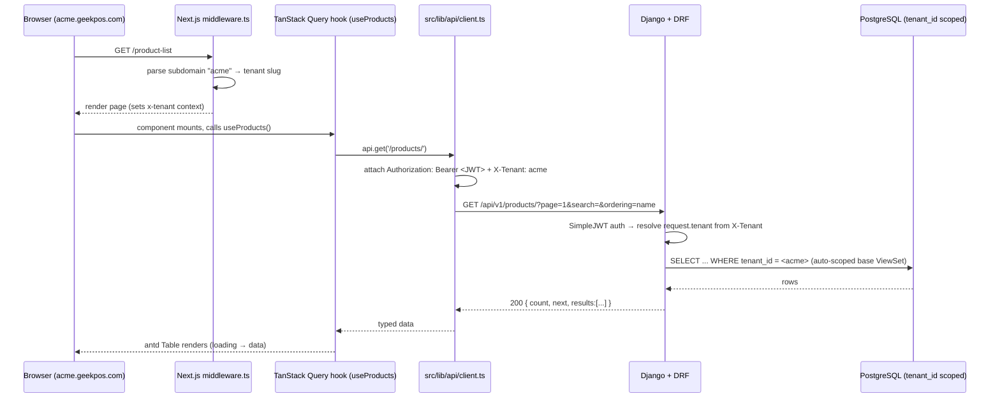
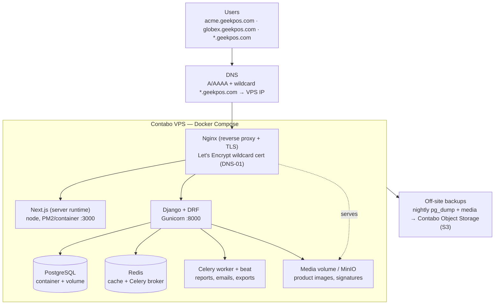
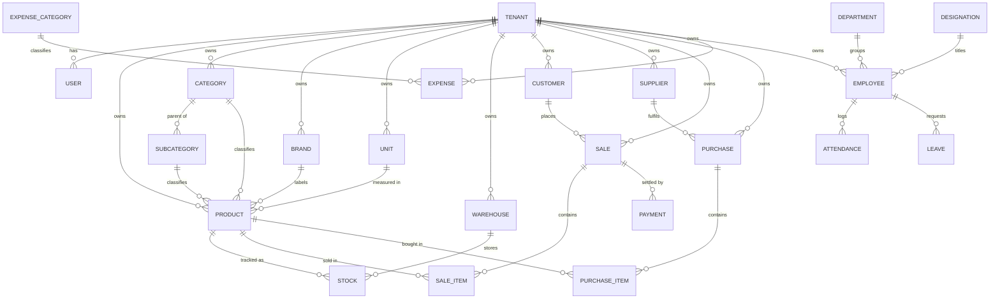

# SaaS Migration Plan — DreamsPOS (Next.js front-end + Django back-end)

> Status: **PLAN ONLY. Not started.** No code changes made yet. Decisions below are locked;
> implementation sequencing is a proposal to be confirmed before work begins.

## Locked decisions

| Decision | Choice |
|---|---|
| Backend | **Build a new Django API** (separate service; Django REST Framework) |
| Scope | **Keep almost all modules** (POS, Inventory, Sales, Purchases, Finance, HRM, CMS, Reports, etc.) |
| Multi-tenancy | **Subdomain per tenant** (`acme.yourpos.com`), **shared database + `tenant_id`** column |
| Front-end | This repo — Next.js 15 App Router (the existing DreamsPOS template) |
| Server model | **Drop `output: "export"`** — run Next.js with a server runtime (needed for middleware/auth/subdomain) |

## Why the template needs work (recap)

It is a **static UI shell**: ~190 screens render from 92 hardcoded JSON files in `src/core/json/`.
No backend, no API/fetch layer, no auth, no real state (Redux installed but unwired), no multi-tenancy,
`any` everywhere, `eslint.ignoreDuringBuilds:true`, and 4500+ placeholder `href="#"`. Converting to a
SaaS = **connecting this UI to a real Django API + adding auth & tenancy**, mostly mechanical per module.

---

## Back-end plan (Django)

Separate repo/service. Suggested stack:

- **Django + Django REST Framework (DRF)** for the API.
- **Auth: `djangorestframework-simplejwt`** — JWT access/refresh tokens. Login returns tokens; Next.js
  stores them (httpOnly cookie preferred) and sends `Authorization: Bearer <token>`.
- **CORS: `django-cors-headers`** — allow the Next.js origin(s), including tenant subdomains
  (`*.yourpos.com`).
- **Multi-tenancy: shared DB + `tenant_id`** (a `Company`/`Tenant` model).
  - Every tenant-owned model gets a `tenant` FK.
  - A **middleware/DRF layer resolves the tenant** from the `X-Tenant` header (sent by the Next.js
    middleware based on the subdomain) and **scopes every queryset** to that tenant automatically
    (base ViewSet / manager that filters by `request.tenant`).
  - Alternative considered: `django-tenants` (schema-per-tenant) — **rejected** for now since the
    decision is shared DB. Keep the `tenant_id` approach.
- **API shape:** REST, one DRF ViewSet per domain resource (products, sales, customers, purchases,
  expenses, employees, ...), paginated list endpoints that match the antd `Table` data the UI expects.
- **Pagination/filter/search:** DRF `PageNumberPagination` + `django-filter` + `SearchFilter` so the
  template's table search/sort can map to query params.
- **Files/media:** Django storage (S3 via `django-storages`) for product images, signatures, etc.

### Endpoint ↔ UI mapping
Each `src/core/json/<x>data.tsx` fixture becomes one Django endpoint. Match the JSON field names in the
DRF serializer so the existing antd column definitions need minimal edits. (Fix the template quirk where
sorters compare `.length` — sorting moves server-side via `ordering` query param.)

---

## Front-end plan (this repo)

### 0. Foundation (do first — pure rails, no features)
- **Remove `output: "export"`** and the `/ → /signin` rewrite from `next.config.ts`.
- Add **`.env`** files: `NEXT_PUBLIC_API_URL`, root domain for subdomain parsing, etc.
- New folders under `src/`:
  ```
  src/lib/api/client.ts      # fetch wrapper: base URL, JWT header, X-Tenant header, refresh, errors
  src/lib/api/<domain>.ts    # typed functions hitting the Django endpoints
  src/hooks/use<Domain>.ts   # TanStack Query hooks (useProducts, useCreateSale, ...)
  src/types/<domain>.ts      # TS interfaces mirroring DRF serializers (replaces `any`)
  src/providers/query-provider.tsx   # QueryClientProvider
  src/providers/auth-provider.tsx    # session/user/token
  src/providers/tenant-provider.tsx  # current tenant from subdomain
  src/middleware.ts          # parse subdomain → tenant; redirect unauthenticated → /signin
  ```
- Wire providers + Redux store into `src/app/layout.tsx`.

### State strategy
- **TanStack Query (React Query)** for all server data (lists, details, mutations) — caching, loading,
  refetch. This is what replaces the JSON fixtures.
- **Redux Toolkit** (already a dependency — finally configure the store) ONLY for genuine client state:
  POS cart, UI/theme prefs, current-tenant snapshot. Do **not** push API data through Redux.

### Auth (login screens already exist as UI)
- Make `(auth)/signin` actually POST to Django, store JWT, populate `auth-provider`.
- `middleware.ts` redirects unauthenticated users to signin; refresh-token flow in `client.ts`.

### Multi-tenancy (subdomain)
- `middleware.ts` reads `host`, extracts subdomain (`acme` from `acme.yourpos.com`), resolves the tenant,
  and sets `x-tenant` for the request; `tenant-provider` exposes it to the UI.
- API client attaches `X-Tenant` (+ JWT) to every request; Django scopes data by it.
- **Local dev:** use `acme.localhost:3000` (works in Chrome) or `/etc/hosts` aliases.

### The per-screen wiring pattern (the repetitive core)
The template is `page.tsx → component → import jsonData`. Conversion is one import swap per screen:
```tsx
// BEFORE
import { productlistdata } from "@/core/json/productlistdata";
const dataSource = productlistdata;
// AFTER
import { useProducts } from "@/hooks/useProducts";
const { data: dataSource = [], isLoading } = useProducts(); // JWT + tenant applied in the client
```
Then turn the `href="#"` actions and modal forms into real create/update/delete mutation hooks.
Because data lives isolated in `src/core/json/`, the visual components barely change.

---

## Phased sequence (proposal)

1. **Backend bootstrap** — Django project, DRF, SimpleJWT, CORS, `Tenant` model + tenant-scoping base
   ViewSet, first resource (Products) with auth.
2. **FE Foundation** — config change, `.env`, `lib/api` + providers + `middleware.ts`, store + QueryClient
   in `layout.tsx`. (No features yet.)
3. **Auth + tenancy end-to-end** — real login, protected routes, subdomain → tenant; prove with one call.
4. **Module-by-module wiring** by business priority:
   Inventory → POS/Sales → Customers/People → Purchases → Finance → Reports → HRM/CMS last.
   Per module: define types → DRF endpoint → API fn + hook → swap JSON import → wire forms/CRUD.
5. **Harden** — re-enable `@typescript-eslint/no-explicit-any` per finished module, flip
   `eslint.ignoreDuringBuilds:false`, add tests, prune unused deps (`npm`, `i`, duplicate chart/dnd libs),
   extract a shared `<PageHeader>`/breadcrumb (currently duplicated inline in ~221 files).

## Open items to decide later (not blocking)
- Cookie vs. in-memory token storage (recommend httpOnly cookie set via a Next.js route handler).
- REST vs. GraphQL — plan assumes **REST/DRF**.
- Superadmin/companies module: reuse the existing template UI as the tenant-management console.
- Wildcard TLS for `*.yourpos.com` in production.
- Whether to truly keep low-value modules (UI-kit demos, duplicate layout variants, pos-2..pos-5) or cut.

---

## How the front-end connects to the back-end (request flow)

Every authenticated request carries two headers: a **JWT** (who you are) and **`X-Tenant`** (which
company's data). The Next.js middleware derives the tenant from the subdomain; the API client attaches
both headers; Django validates the token and scopes the queryset to that tenant.



**Contract rules that keep wiring mechanical:**
- DRF serializer field names **match the existing JSON fixture field names** → antd column defs barely change.
- List endpoints return DRF `PageNumberPagination` shape `{ count, next, previous, results }`.
- Search → `?search=`, sort → `?ordering=field` / `?ordering=-field`, filters → `django-filter` query params.
- Mutations (create/update/delete) map to the `href="#"` modal forms, exposed as TanStack Query mutations.

---

## Hosting & infrastructure (decision: **self-hosted VPS — Contabo primary, DigitalOcean alternative**)

Run everything on a Linux VPS, orchestrated with **Docker Compose** behind **Nginx**. **Contabo** is the
chosen primary (most RAM/vCPU/disk per dollar). **DigitalOcean** is the documented alternative / fallback —
pricier, but better network, console, managed add-ons, and docs. The **same Docker Compose stack runs on
either**, so the provider is not locked into the app — only into ops tooling. Start single-node; split
services onto more boxes only when load demands it.

### Option A — Contabo (primary)
Cheapest per resource; trade-off is more manual ops and more basic network/support.
- **Sizing:** a **Cloud VPS** (e.g. VPS M/L — ~6–8 vCPU, 16–32 GB RAM, NVMe) comfortably runs the full
  Compose stack for early SaaS load. Scale vertically first (Contabo lets you upgrade the plan).
- **Storage:** keep Postgres data + media on the NVMe system disk early; add a **Contabo Object Storage**
  (S3-compatible) bucket for off-site backups and product media (works as the MinIO/S3 target below).
- **OS:** Ubuntu LTS image; harden on first boot (Contabo defaults are bare — set up `ufw`, SSH keys,
  disable password login, fail2ban immediately).
- **Network:** order/confirm a clean **IPv4 + IPv6**; Contabo IPs occasionally land on mail blocklists, so
  send transactional email via a relay (Postmark/SES/Mailgun), **not** the box's own SMTP.
- **Backups:** Contabo's auto-backup add-on covers the VPS image; still run app-level nightly `pg_dump` +
  media sync to Contabo Object Storage (or another provider) and **test restores** — don't rely on the
  image snapshot alone.

### Option B — DigitalOcean (alternative / fallback)
More expensive for the same RAM/CPU, but smoother ops and a clear managed-upgrade path if self-managing
Postgres becomes a burden.
- **Sizing:** start on a **Basic/Premium Droplet** (e.g. 4 vCPU / 8–16 GB, NVMe) for the Compose stack;
  resize live as load grows. Use **Reserved IP** so you can rebuild the box without changing DNS.
- **Storage:** attach a **Block Storage Volume** for Postgres/media data (survives droplet rebuilds);
  use **DO Spaces** (S3-compatible) + the built-in **Spaces CDN** for backups and product media.
- **Managed upgrade path:** offload Postgres to **DO Managed Databases** (automated backups, failover,
  patching) and/or Redis to a managed instance — drop those containers from Compose, keep the rest. This is
  DO's main advantage over Contabo: you can stop babysitting the DB without re-platforming.
- **Networking/TLS:** add a **DO Load Balancer** (with managed Let's Encrypt certs incl. wildcard) once you
  run more than one app box; single-node, Nginx + certbot on the droplet is enough.
- **Email:** same rule — relay transactional mail (Postmark/SES/Mailgun); don't send from the droplet.
- **Backups:** enable Droplet backups/snapshots **and** keep app-level `pg_dump` → Spaces; test restores.

### Quick comparison
| Dimension | Contabo (primary) | DigitalOcean (alternative) |
|---|---|---|
| Cost / resource | 🟢 Cheapest (most RAM/CPU/disk per $) | 🟡 ~2–3× pricier for same specs |
| Ops effort | 🟡 More manual (bare images, self-managed DB) | 🟢 Smoother (snapshots, managed DB/Redis option) |
| Network / latency | 🟡 Adequate; fewer regions, IPs sometimes blocklisted | 🟢 Strong global network + CDN |
| Object storage | Contabo Object Storage (S3) | DO Spaces + Spaces CDN (S3) |
| Managed DB | ❌ Self-host Postgres in container | ✅ DO Managed Databases (optional) |
| Best when | Maximizing runway / cost per tenant | Want low-ops + easy managed upgrades |

> **App-portability rule:** keep all provider differences in infra config (Compose env, Nginx, backup
> scripts, object-storage endpoint) — **never** in application code. The S3 endpoint, DB host, and Redis URL
> are all `.env` values, so switching Contabo ↔ DigitalOcean is a redeploy, not a rewrite.



### Components on the box
| Service | Container | Notes |
|---|---|---|
| Reverse proxy + TLS | `nginx` | Terminates HTTPS, routes `/api/*` → Django, everything else → Next.js. Wildcard cert via Let's Encrypt **DNS-01** challenge (needed for `*.geekpos.com`). |
| Front-end | `web-next` | Next.js with **server runtime** (no static export). |
| API | `api-django` | Gunicorn + DRF. |
| Database | `postgres` | Single shared DB, `tenant_id` column on tenant-owned tables. Persistent volume. |
| Cache / broker | `redis` | DRF cache + Celery broker/result backend. |
| Async workers | `celery`, `celery-beat` | Heavy reports, email, scheduled jobs. |
| Media | volume **or** `minio` | Product images etc. MinIO if you want S3-compatible API now, plain volume if not. |

### Operational must-haves (self-hosting owns these)
- **TLS:** `certbot` with a DNS plugin (Cloudflare/your DNS provider) for the wildcard cert; auto-renew via cron/systemd timer.
- **Backups:** nightly `pg_dump` + media sync to off-site object storage; **test restores**.
- **Secrets:** `.env` on the host (not in git) or Docker secrets; never commit `NEXT_PUBLIC_API_URL` prod values, DB creds, JWT signing key.
- **CI/CD:** GitHub Actions → SSH/`docker compose pull && up -d` (or Watchtower). Build images in CI, deploy by tag.
- **Monitoring/logs:** `docker logs` + a lightweight stack (Uptime Kuma for uptime, Loki/Grafana or Netdata for metrics).
- **Firewall & hardening:** `ufw` (allow 80/443/22 only), fail2ban, SSH keys only, automatic security updates.
- **Subdomain routing:** wildcard DNS `*.geekpos.com` → the VPS; Nginx passes `Host` through so Next.js middleware can read the subdomain.
- **Scaling path:** vertical first (bigger box); then move Postgres to its own VPS, add a second app box, put Nginx/HAProxy in front. Object storage (MinIO/S3) before multi-node so media is shared.

### Local dev parity
Same `docker-compose.yml` runs locally. Use `acme.localhost:3000` (Chrome resolves `*.localhost`) or
`/etc/hosts` aliases to exercise subdomain → tenant resolution without real DNS.

---

## Back-end data model (Django ER)

Derived from the 92 fixtures in `src/core/json/`. **Every tenant-owned table gets a `tenant_id` FK**
(shared-DB tenancy). `Tenant`, `User`, and global lookups (e.g. `Country`, plan/`Package`) are the only
non-scoped tables. Field names mirror the JSON fixtures so the antd columns need minimal edits.



### Core models (fields drawn from the fixtures)

| Model | Maps to fixture | Key fields (besides `id`, `tenant`, timestamps) |
|---|---|---|
| `Tenant` | `companiesdetails`, `domainDetails` | name, subdomain (unique), package FK, status, plan dates |
| `User` | `users` | email, role FK, name, avatar, is_active (Django auth + DRF SimpleJWT) |
| `Category` | `categorylistdata` | name, slug, status |
| `SubCategory` | `subcategorydata` | name, slug, category FK, status |
| `Brand` | `brandlistdata` | name, logo, status |
| `Unit` | `unitsdata` | name, short_name, status |
| `Warehouse` | `warehouse` | name, contact, phone, address |
| `Product` | `productlistdata`, `productsdata` | name, sku (unique per tenant), category FK, subcategory FK, brand FK, unit FK, price, cost, image, status, created_by |
| `Stock` | `managestocks_data`, `lowstockdata` | product FK, warehouse FK, qty, alert_qty |
| `Customer` | `customerData`, `customer_data` | code, name, email, phone, country, image, status |
| `Supplier` | `supplier_data`, `billerData` | code, name, email, phone, country, address, status |
| `Sale` | `saleslistdata`, `ordersdata` | reference, customer FK, biller, date, status, grand_total, paid, due, payment_status |
| `SaleItem` | (sale detail) | sale FK, product FK, qty, unit_price, discount, tax, subtotal |
| `Purchase` | `purchaselistdata`, `purchasereturn` | reference, supplier FK, date, status, grand_total, paid, due, created_by |
| `PurchaseItem` | (purchase detail) | purchase FK, product FK, qty, unit_cost, subtotal |
| `Payment` | (sale/purchase payment) | sale/purchase FK, amount, method, date, reference |
| `Expense` | `expenselistdata` | expense_category FK, name, amount, date, reference, status |
| `ExpenseCategory` | `expensecategory` | name, description, status |
| `Employee` | `employeeListData` | emp_id, name, email, phone, department FK, designation FK, shift FK, status |
| `Department` | `departmentlistdata` | name, head, status |
| `Designation` | `designationdata` | name, department FK, status |
| `Attendance` | `attendanceadmindata` | employee FK, date, clock_in, clock_out, status |
| `Leave` | `leavesdata`, `leavetypedata` | employee FK, leave_type FK, from, to, days, reason, status |
| `Account` | `accountList` | name, type FK, balance, account_number |
| `Coupon` / `Discount` / `GiftCard` | `coupons`, `discountData`, `giftCardData` | code, type, value, validity, status |
| `Role` / `Permission` | `rolesandpermissiondata` | name, permissions (per-tenant RBAC) |

> **`status`** fields → use a Django `TextChoices` enum, not free text. **Money** fixtures are strings
> like `"$550"` → store as `DecimalField`; strip currency formatting in the serializer/UI, not the DB.
> **Dates** are display strings (`"19 Jan 2023"`) → store as real `DateField`/`DateTimeField`.

### Tenant-scoping enforcement (the safety rail)
```python
# Base manager + ViewSet so no endpoint can leak across tenants by accident
class TenantQuerySet(models.QuerySet):
    def for_tenant(self, tenant): return self.filter(tenant=tenant)

class TenantViewSet(viewsets.ModelViewSet):
    def get_queryset(self):
        return super().get_queryset().filter(tenant=self.request.tenant)
    def perform_create(self, serializer):
        serializer.save(tenant=self.request.tenant)
```
`request.tenant` is set by middleware from the `X-Tenant` header (validated against the JWT's allowed tenants).

---

## Testing strategy

**Policy: both repos require unit tests on every new/changed feature.** No untested business logic, no
untested endpoint, no untested data hook.

### Front-end (this repo) — see [`README.md`](README.md#-testing-required) for full setup
- **Vitest + React Testing Library + jsdom** for unit/component tests; **MSW** to mock Django endpoints;
  **Playwright** for E2E later.
- Co-locate `*.test.tsx` with source. Prioritize **POS cart math, totals/tax/discount, hooks, table search**.

### Back-end (Django) — standard
- **`pytest` + `pytest-django`** (preferred over Django's `unittest` TestCase for fixtures/parametrization).
- **`factory_boy`** (or `model_bakery`) to build model instances; **DRF `APIClient`** for endpoint tests.
- **`pytest-cov`** for coverage; run in CI on every PR.

```bash
pip install pytest pytest-django pytest-cov factory_boy
```
`pytest.ini`:
```ini
[pytest]
DJANGO_SETTINGS_MODULE = config.settings.test
python_files = tests.py test_*.py *_tests.py
```

**The non-negotiable backend test — tenant isolation** (the safety rail must be proven, not assumed):
```python
import pytest
from rest_framework.test import APIClient

@pytest.mark.django_db
def test_tenant_cannot_read_another_tenants_products(tenant_a, tenant_b, product_factory):
    product_factory(tenant=tenant_b, name="Secret Widget")
    client = APIClient()
    client.force_authenticate(user=tenant_a.owner)
    res = client.get("/api/v1/products/", HTTP_X_TENANT=tenant_a.subdomain)
    names = [p["name"] for p in res.json()["results"]]
    assert "Secret Widget" not in names          # tenant B's data must NOT leak to tenant A
    assert res.status_code == 200
```

**What to test (backend priority):**
1. **Tenant scoping** — every ViewSet: a tenant can't read/write another tenant's rows (parametrize across resources).
2. **Auth** — login returns JWT, refresh works, unauthenticated → 401, wrong/missing `X-Tenant` → 403.
3. **Business calculations** — sale totals = Σ(item subtotal) − discount + tax; due = grand_total − paid; stock decrements on sale, increments on purchase/return.
4. **Serializers** — field names match the front-end fixtures; money/date parsing; validation errors.
5. **Endpoints** — list pagination shape `{count,next,previous,results}`, `?search=`/`?ordering=`/filters.

### Per-module Definition of Done (DoD)
When wiring a module (the phase-4 loop), it isn't "done" until:
- [ ] Backend: model + serializer + ViewSet **with tests** (tenant isolation + happy path + validation).
- [ ] Front-end: hook + screen wired, **with tests** (renders data, search/sort, mutation happy path).
- [ ] Both test suites green in CI; coverage not decreased.
