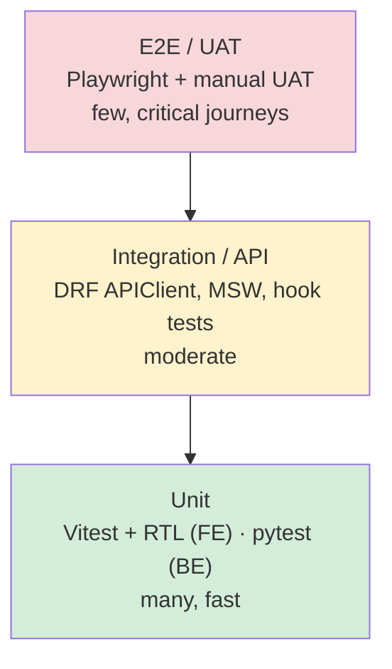
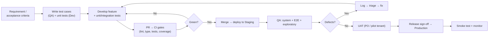
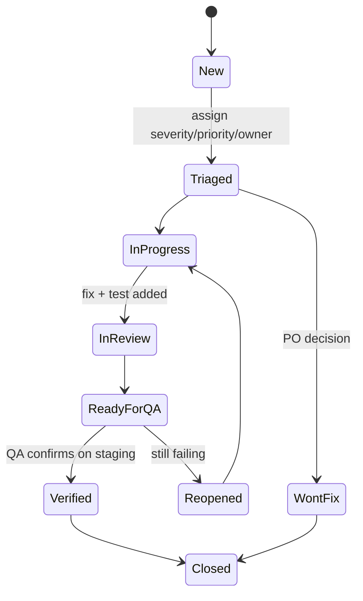

# Software Quality Assurance (SQA) Plan — GeekPOS

> Companion to [`README.md`](README.md) (architecture) and [`SAAS_PLAN.md`](SAAS_PLAN.md) (backend + hosting).
> This document defines **how quality is assured** across the GeekPOS SaaS — test strategy, levels, process,
> defect management, environments, and release sign-off.
> Status: **plan / standard** to follow as modules are wired from the template to the real Django API.

---

## 📑 Table of Contents

1. [Purpose & Scope](#1-purpose--scope)
2. [Quality Objectives](#2-quality-objectives)
3. [Roles & Responsibilities](#3-roles--responsibilities)
4. [Test Levels (the pyramid)](#4-test-levels-the-pyramid)
5. [Test Types](#5-test-types)
6. [Test Process & Workflow](#6-test-process--workflow)
7. [Entry & Exit Criteria](#7-entry--exit-criteria)
8. [Module Test Scope](#8-module-test-scope)
9. [Test Environments](#9-test-environments)
10. [Test Data Strategy (multi-tenant)](#10-test-data-strategy-multi-tenant)
11. [Defect Management](#11-defect-management)
12. [Test Case Management & Traceability](#12-test-case-management--traceability)
13. [Automation & CI/CD Quality Gates](#13-automation--cicd-quality-gates)
14. [Risk-Based Testing](#14-risk-based-testing)
15. [Metrics & Reporting (KPIs)](#15-metrics--reporting-kpis)
16. [Release / Sign-off Criteria](#16-release--sign-off-criteria)
17. [Tooling Summary](#17-tooling-summary)

---

## 1. Purpose & Scope

**Purpose:** ensure GeekPOS is **correct, secure, and reliable** before it reaches tenants — with special
attention to the things a POS *cannot* get wrong: **money math, inventory accuracy, and tenant data isolation.**

**In scope:**
- All **business modules**: POS/checkout, Inventory, Sales, Purchases, Finance & Accounts, HRM, Reports, People, Promo, Settings, User Management, Superadmin.
- Front-end (Next.js) ↔ back-end (Django/DRF) integration, auth (JWT), multi-tenancy (subdomain → `tenant_id`).
- Non-functional: performance, security, usability, cross-browser/responsive, accessibility (baseline).

**Out of scope (low priority):** template filler not wired to the API — `uiinterface` UI-kit demos, `charts`
demos, mock `application` screens (chat/email/notes/todo/file-manager), duplicate layout variants and
`pos-2..pos-5` unless promoted to real screens.

---

## 2. Quality Objectives

| # | Objective | Measure |
|---|---|---|
| Q1 | No money/calculation errors in POS, invoices, payments, reports | 100% pass on calculation test suite; 0 open Sev-1/2 in finance flows |
| Q2 | Absolute tenant data isolation | Tenant-isolation tests pass for **every** resource; 0 cross-tenant leaks |
| Q3 | Inventory accuracy | Stock in/out reconciles across sale/purchase/return/adjustment/transfer |
| Q4 | Secure auth & access control | JWT + RBAC tests pass; security review clean of high-severity findings |
| Q5 | Stable releases | < 2% defect escape rate to production; all critical paths regression-covered |
| Q6 | Acceptable performance | API p95 < 500 ms on list endpoints (typical data); page interactive < 3 s |
| Q7 | Maintainable test suite | Coverage on business modules ≥ 70%; CI green required to merge |

---

## 3. Roles & Responsibilities

| Role | Responsibility |
|---|---|
| **Developer** | Writes unit + integration tests with the feature (see README/SAAS_PLAN); fixes defects; keeps CI green. |
| **QA Engineer** | Owns test plan & cases, manual exploratory + E2E automation, regression suite, defect triage. |
| **Tech Lead** | Defines acceptance criteria, reviews test coverage, approves merges, risk calls. |
| **Product Owner** | Signs off UAT, prioritizes defects by business impact, approves release. |
| **DevOps** | CI/CD quality gates, staging/prod environments, monitoring, rollback. |

> **Shift-left principle:** quality is everyone's job. Developers test first (unit/integration); QA adds
> system/E2E/exploratory depth. Bugs are cheapest to fix at the unit level.

---

## 4. Test Levels (the pyramid)



| Level | Owner | Tooling | What it proves |
|---|---|---|---|
| **Unit** | Dev | Vitest + RTL (FE), pytest (BE) | Pure logic: cart math, serializers, helpers, components in isolation |
| **Integration / API** | Dev + QA | DRF `APIClient`, MSW-mocked hooks | FE ↔ API contract, endpoint behavior, tenant scoping, auth |
| **System / E2E** | QA | Playwright | Full journeys across UI + API + DB (login → sell → invoice) |
| **UAT** | PO / pilot tenant | Manual, staging | Real-world acceptance before release |

Foundational unit-test setup lives in [`README.md` → Testing](README.md#-testing-required) (frontend) and
[`SAAS_PLAN.md` → Testing strategy](SAAS_PLAN.md#testing-strategy) (backend). This plan governs the levels above.

---

## 5. Test Types

| Type | What | When |
|---|---|---|
| **Functional** | Each feature behaves to spec / acceptance criteria | Every module |
| **Regression** | Existing features still work after changes | Every PR (automated) + pre-release (full) |
| **Integration** | Modules + FE/BE work together | Every module wiring |
| **Multi-tenancy isolation** ⭐ | One tenant can never see/modify another's data | Every resource, non-negotiable |
| **Security** | Auth, RBAC, injection, XSS, JWT handling, CORS, rate limits | Per release + security review |
| **Performance** | API latency, page load, large dataset behavior, concurrency | Pre-release + on perf-sensitive screens |
| **Usability** | Flows are clear; errors are actionable | Exploratory, UAT |
| **Compatibility** | Browsers (Chrome/Firefox/Safari/Edge) + responsive (desktop/tablet/mobile) | Pre-release |
| **Accessibility (baseline)** | Keyboard nav, labels, contrast | Pre-release |
| **Smoke / Sanity** | Critical paths up after deploy | Every deploy |

⭐ **Multi-tenancy isolation is the highest-risk area for a shared-DB SaaS** — test it on every endpoint.

---

## 6. Test Process & Workflow



**Per-feature loop (mirrors SAAS_PLAN phase-4 module wiring):**
1. Define acceptance criteria → 2. Author test cases → 3. Build + unit/integration tests → 4. PR through CI gates → 5. QA on staging (E2E + exploratory) → 6. UAT → 7. Sign-off → 8. Release + smoke + monitor.

---

## 7. Entry & Exit Criteria

**Entry to QA (a build is testable when):**
- Feature is code-complete and merged to the staging branch.
- Unit + integration tests exist and pass in CI; build deploys to staging cleanly.
- Acceptance criteria and test cases are written.
- Test data / tenant fixtures are seeded.

**Exit from QA (ready to release when):**
- All planned test cases executed; **0 open Sev-1 / Sev-2** defects.
- Sev-3/4 either fixed or accepted by PO with a tracked ticket.
- Regression suite green; coverage targets met (business modules ≥ 70%).
- Tenant-isolation, auth, and calculation suites 100% green.
- UAT signed off by Product Owner.

---

## 8. Module Test Scope

Priority follows business value (and the SAAS_PLAN wiring order). Each module's **critical test focus**:

| Module | Critical test focus |
|---|---|
| **POS / Checkout** ⭐ | Cart add/remove/qty; **subtotal = Σ(price×qty)**; discount (flat & %), GST/tax, rounding; payment (cash/card/split), change due; hold/recall; receipt; offline edge cases |
| **Inventory** ⭐ | Product CRUD, SKU uniqueness per tenant, category/brand/unit links; stock levels; low-stock & expiry alerts; barcode/QR |
| **Sales** | Invoice list/detail, totals = items − discount + tax; **due = grand_total − paid**; sale return adjusts stock & balance; quotation → order |
| **Purchases** | Purchase order, receive (stock ↑), returns (stock ↓), supplier balance, totals |
| **Stock movement** | Adjustment (+/−), transfer between warehouses conserves total qty, history accuracy |
| **Finance & Accounts** ⭐ | Account balances, statement, expenses, income, money transfer; trial balance / balance sheet **must reconcile** |
| **Reports** ⭐ | Numbers match source transactions; date-range filters; export (PDF/CSV) integrity; server-side sort/filter |
| **HRM** | Employee CRUD; attendance clock in/out; leave request → approval; payroll calc; payslip |
| **People** | Suppliers/customers/billers/warehouses CRUD; uniqueness; contact validation |
| **Promo** | Discount/coupon/gift-card validity windows, value caps, correct application at POS |
| **User Management** | Users, **roles & permissions enforcement** (RBAC), delete account |
| **Auth & Tenancy** ⭐ | Login/logout, JWT refresh/expiry, subdomain → tenant, protected routes, **cross-tenant isolation** |
| **Superadmin** | Tenant/company CRUD, packages, subscriptions, domain mgmt, plan limits |
| **Settings** | Config persists per tenant; affects behavior (currency, tax) correctly |

⭐ = highest risk; deepest coverage + regression priority.

---

## 9. Test Environments

| Env | Purpose | Data | Notes |
|---|---|---|---|
| **Local** | Dev unit/integration | Seeded fixtures / factories | `acme.localhost:3000` for subdomain testing |
| **CI** | Automated gates on every PR | Ephemeral test DB | Vitest + pytest + lint + type-check |
| **Staging** | QA system/E2E + UAT | Anonymized prod-like, ≥2 tenants | Mirrors prod (Contabo/DO Docker Compose); pre-release target |
| **Production** | Live | Real tenant data | Smoke tests only; monitored |

- Staging must mirror production config (same Docker Compose stack, Nginx, Postgres, Redis).
- **Never test with real customer data** outside production; anonymize for staging.

---

## 10. Test Data Strategy (multi-tenant)

- Always seed **≥ 2 tenants** (e.g. `acme`, `globex`) so isolation is testable by default.
- Use **`factory_boy`/`model_bakery`** (BE) and fixture builders (FE) — avoid hardcoded IDs.
- Cover edge data: empty states, large datasets (pagination/perf), boundary values (0 qty, max discount, negative-prevention), unicode/long strings, currency rounding (e.g. `0.005`).
- Each test sets up and tears down its own data; tests must be **independent and order-agnostic**.
- The template's existing `src/core/json/` fixtures are a good source of realistic seed values for staging.

---

## 11. Defect Management

### Severity (impact) × Priority (urgency)

| Severity | Definition | Example |
|---|---|---|
| **Sev-1 Critical** | Data loss/corruption, security breach, cross-tenant leak, checkout broken | Tenant A sees Tenant B's sales; payment charges wrong amount |
| **Sev-2 Major** | Core feature broken, no workaround | Can't create invoice; report totals wrong |
| **Sev-3 Minor** | Feature impaired, workaround exists | Sort broken on one column; validation message missing |
| **Sev-4 Trivial** | Cosmetic | Misaligned label, typo |

Priority: **P0 (now) / P1 (this release) / P2 (next) / P3 (backlog).** Sev-1 ⇒ P0 by default.

### Defect lifecycle



**Every bug fix must add a regression test** that fails before and passes after — so it can't silently return.

### Bug report template
```
Title:        <concise summary>
Module:       <POS / Inventory / ...>
Severity:     Sev-1..4      Priority: P0..3
Environment:  Staging / Prod  | Tenant: acme  | Browser/Device:
Steps to reproduce: 1) ... 2) ... 3) ...
Expected:     ...
Actual:       ...
Evidence:     screenshot / video / logs / request-id
```

---

## 12. Test Case Management & Traceability

- Maintain a **requirements ↔ test-case traceability matrix**: every acceptance criterion maps to ≥1 test case; every critical test case maps to an automated test.
- Test case ID format: `TC-<MODULE>-<NNN>` (e.g. `TC-POS-014`).
- Store cases in the team's tracker (Jira/ClickUp/TestRail/Google Sheet) linked to user stories and to the automated test file path.
- A feature is traceable only when: **requirement → test case → automated test → CI result** are linked.

Example case:
| ID | Module | Title | Pre-cond | Steps | Expected | Type | Auto? |
|---|---|---|---|---|---|---|---|
| TC-POS-014 | POS | 10% discount applies to subtotal | Cart has items totalling $200 | Apply 10% discount | Total = $180 (+ tax if configured) | Functional | ✅ |
| TC-AUTH-003 | Tenancy | Cross-tenant read blocked | Tenant B has a product | As Tenant A, GET /products/ | B's product absent; 200 | Security | ✅ |

---

## 13. Automation & CI/CD Quality Gates

**Pyramid in practice:** automate heavily at unit/integration; reserve E2E for critical journeys (slow, brittle if overused).

**CI gates — a PR cannot merge unless ALL pass:**
1. Lint (`npm run lint`) — and incrementally re-enable `no-explicit-any` / `ignoreDuringBuilds:false` (see SAAS_PLAN harden phase).
2. Type-check (`tsc --noEmit`).
3. Unit + integration tests (`npm test` FE, `pytest` BE) — **green required**.
4. Coverage threshold (business modules ≥ 70%); must not decrease.
5. Build succeeds.

**Pre-release pipeline (on staging):** full regression + E2E (Playwright) + smoke + (periodic) performance & security scans.

**Post-deploy:** automated smoke test of critical paths + monitoring/alerting (Uptime Kuma, logs).

---

## 14. Risk-Based Testing

Focus effort where failure hurts most.

| Risk area | Likelihood | Impact | Mitigation |
|---|---|---|---|
| Cross-tenant data leak (shared DB) | Medium | **Critical** | Isolation test on every endpoint; base ViewSet enforced; security review |
| Money/tax/discount miscalculation | Medium | **Critical** | Exhaustive calculation unit tests incl. rounding & boundaries |
| Inventory drift | Medium | High | Reconciliation tests across all stock movements |
| Auth/JWT/RBAC flaws | Medium | **Critical** | Auth + permission test suite; refresh/expiry; security scan |
| Report inaccuracy | Medium | High | Reports validated against source transactions |
| Perf on large datasets | Medium | Medium | Server-side pagination/sort tested with bulk data |
| Giant components (2k–3.6k LOC) hide bugs | High | Medium | Extract logic into tested helpers while wiring (SAAS_PLAN) |

---

## 15. Metrics & Reporting (KPIs)

| Metric | Target | Why |
|---|---|---|
| Test pass rate | 100% before release | Gate |
| Code coverage (business modules) | ≥ 70% | Maintainability |
| Defect escape rate (prod bugs ÷ total) | < 2% | QA effectiveness |
| Defect density per module | Trend down | Focus next effort |
| Mean time to detect / resolve | Trend down | Process health |
| Critical-path E2E pass | 100% | Release safety |
| Open Sev-1/Sev-2 at release | 0 | Hard gate |

Report cadence: CI dashboard per PR; QA summary per release (executed/passed/failed, open defects by severity, coverage, risks).

---

## 16. Release / Sign-off Criteria

A release is approved only when **all** are true:

- [ ] All planned test cases executed; results recorded.
- [ ] **0 open Sev-1 / Sev-2** defects; Sev-3/4 triaged & accepted by PO.
- [ ] Regression suite green; coverage targets met.
- [ ] Tenant-isolation, auth, and calculation suites **100% green**.
- [ ] Performance within targets on key endpoints/screens.
- [ ] Security review (per release) — no high-severity findings open.
- [ ] Cross-browser/responsive smoke passed.
- [ ] UAT signed off by Product Owner.
- [ ] Rollback plan + DB backup verified (see SAAS_PLAN hosting/backups).
- [ ] Post-deploy smoke + monitoring confirmed green.

**Sign-off:** QA Lead (test completion) + Product Owner (acceptance) + DevOps (deploy readiness).

---

## 17. Tooling Summary

| Concern | Tool |
|---|---|
| FE unit/component | Vitest + React Testing Library + jsdom |
| FE API mocking | MSW |
| BE unit/API | pytest + pytest-django + factory_boy + DRF APIClient |
| E2E | Playwright |
| Coverage | vitest --coverage / pytest-cov |
| Lint / type | ESLint (next) / tsc |
| Performance | Lighthouse (FE), k6 / Locust (API) |
| Security | OWASP ZAP scan, dependency audit (`npm audit`, `pip-audit`) |
| CI/CD | GitHub Actions (gates) → deploy to Contabo/DO |
| Test/defect tracking | Jira / ClickUp / TestRail (team choice) |
| Monitoring | Uptime Kuma, logs/metrics (Loki/Grafana or Netdata) |

---

*See [`README.md`](README.md) for architecture and the unit-testing setup, and [`SAAS_PLAN.md`](SAAS_PLAN.md)
for the backend, hosting, and testing strategy this plan builds on.*
